# Design Project: Frogger Game
## Design Problem
To potentially train wildlife to avoid cars, the simulation of a frog crossing a high-traffic road using concepts learned in EE 271 can provide insight. The simulation should include two roads of cars moving in alternate directions with a single animal, such as a frog, starting from one safe end of the road and trying to reach the other side to accurately represent the situation of passing traffic for wildlife.

The cars are represented by orange LEDs on the LED Array attachment to the De1-SoC board, and the uppermost cars move leftward while the cars parallel move rightward with a median in between. The frog is represented by a green LED which can move around the allocated 5x6 upper-left section of the LED Array. The frog starts in the 5th row from the top, and attempts to reach the topmost row while avoiding the passing cars. The frog is controlled by four buttons: KEY[3], KEY[2], KEY[1], KEY[0], which move the frog left, right, forwards, or back respectively. Each key press is only counted once, even when holding it down. 

Reaching the topmost row of the LED Array grants one point for a win, updating the HEX0 display with the new value for a maximum of 7 wins. If the frog, however, becomes roadkill instead, then the HEX0 display updates, decreasing the total wins by 1 to a minimum of 0.

The general functionality of the frog and vehicles is illustrated (Fig. 1) to convey how each part of the simulation is generated.
 
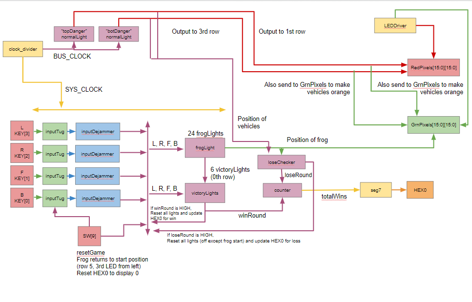
> Fig. 1. User Level Block Diagram

The 5 rows * 6 columns upper-left section of the LED Array board will be controlled as demonstrated by the block diagram above.

## Methods and Procedures
### Button Input Design
The system inputs and outputs are controlled by the leading edge of a 1526 Hz clock. Button presses are counted only if the button was pressed over a clock edge. The frog light will only ever move on a clock edge. This control over timing also ensures the button cannot be held down over multiple clock edges to count for multiple button taps, but instead just one (Fig. 2). Additionally, player input is run through two flip-flops to ensure stable inputs (and therefore outputs) through instantiated inputDejammer (included in Fig. 7). 

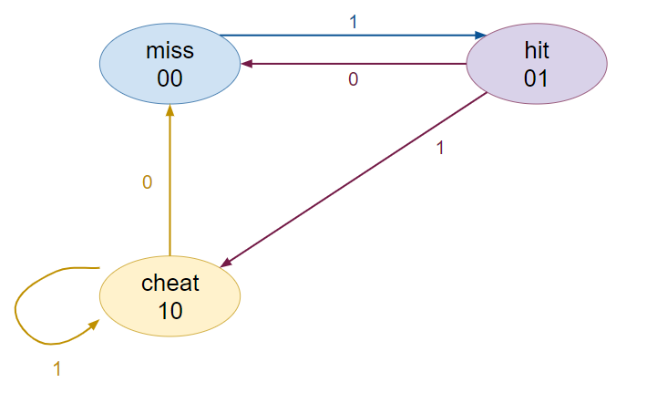
> Fig. 2. inputTug State Diagram

The state diagram for the inputTug module, which takes the user input and determines whether it is a miss, a valid hit, or a cheat (pressing button continuously). A 1 represents that the button is pressed, and 0 means unpressed. InputTug was instantiated once for each button for four total instantiations.

When the frog light reaches the uppermost row of the playfield, then the round was won and the win count is updated on the HEX0 display. If the frog is controlled to be in the same position as a car, then the round was lost and the win count is decreased on the HEX0 display. Upon game reset, which is by flipping SW[9], the win count is set back to 0. The win count is only increased or decreased in response to wins or losses on round resets, which occur automatically after a win or a loss. Upon any reset, the frog is set back to its initial position on the 5th row, the third LED from the left on the LED Array and will not move until the player presses a button.

To control which LED is on for the frog, each LED is controlled by module frogLight with inputs of the different keybuttons pressed, which are L, R, F, and B (whether the left, right, forward, or backward button was pressed respectively), and whether certain adjacent lights are currently on. From this, the two states of whether a light is on or off can be determined (Fig. 3).
Frog Movement and Round Win Design
 
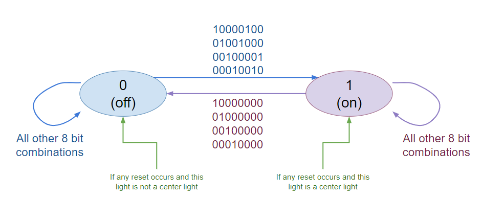
> Fig. 3. frogLight State Diagram

8 bit inputs for frogLight are: L, R, F, B, NL, NR, NF, NB in that order, with a 1 representing that the corresponding key was pressed, and a 0 means unpressed.

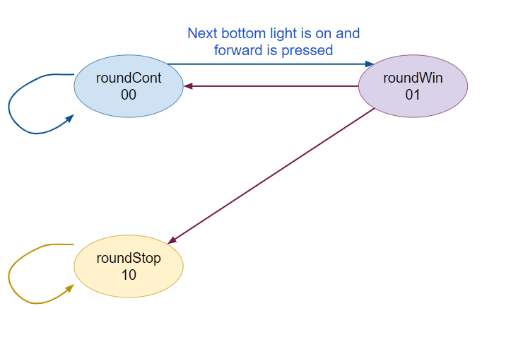
> Fig. 4. victoryLight State Diagram

To control the victory case for the frog, the uppermost row of LEDs on the LED Array were each individually controlled by a victoryLight module to determine the state of the game round. The round should continue if it hasn’t been won yet, send an output if the round is won, and otherwise should not allow any further changes until the round is reset after a win (Fig. 4). The reset occurs automatically afterwards.

### Vehicle Movement and Round Loss Design
The vehicle movement was determined by identifying the different states the LEDs could be in a row, and establishing what the next state for the light should be depending on the inputs. The possible states and what combination of inputs could transition between them was illustrated with a state diagram.

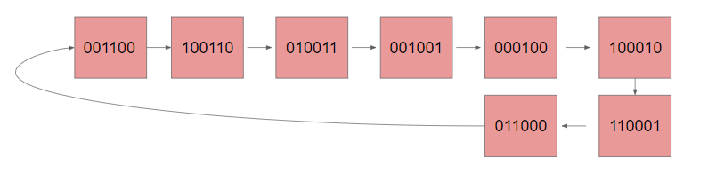
> Fig. 5. normalLight State Diagram for Rightward Vehicles

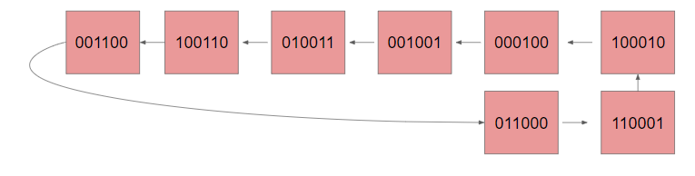 
> Fig. 6. normalLight State Diagram for Leftward Vehicles

The state diagrams for normalLight are shown in Fig. 7 and 8 with alternating direction. normalLight controls which LEDs are turned on in a row of 6. Each 0 represents an LED off and each 1 represents an LED on. Each state transitions to the next automatically.

All state diagrams were later transferred into Verilog to be simulated and then input into the De1-SoC board. The overall design of the system is illustrated below (Fig. 7).

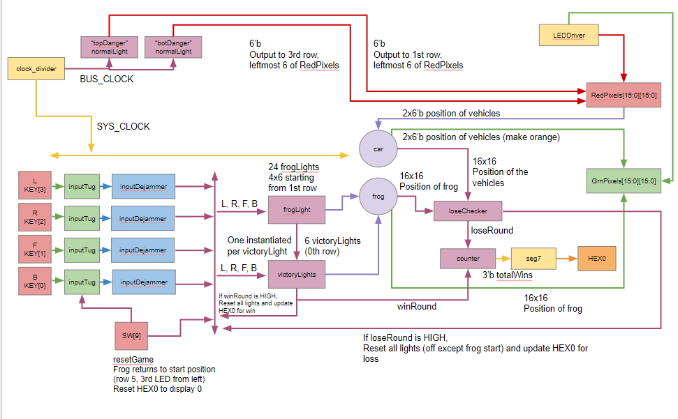
> Fig. 7. Designer Level Block Diagram

The 5 rows * 6 columns upper-left section of the LED Array board are controlled by the modules included in the block diagram above. The four keybuttons are transferred through the modules to eventually control the position of the frog in frogLight and victoryLight, which is displayed with GrnPixels. The lights for the vehicles are displayed with both GrnPixels and RedPixels, which are 16x16 arrays from the LEDDriver that control the LED Array. There is detail on the size of outputs or inputs and significant internal variables “car” and “frog” convey the interconnectedness of many of the modules.

Furthermore, the design was minimized for number of gates, which is discussed below in the Generalized Resource Utilization by Entity Report under Results. A more detailed and comprehensive report, including every instantiation of every module is in the Appendix.

## Results
### Simulations in ModelSim:
Each module was simulated in ModelSim to observe outputs and ensure expected behavior.

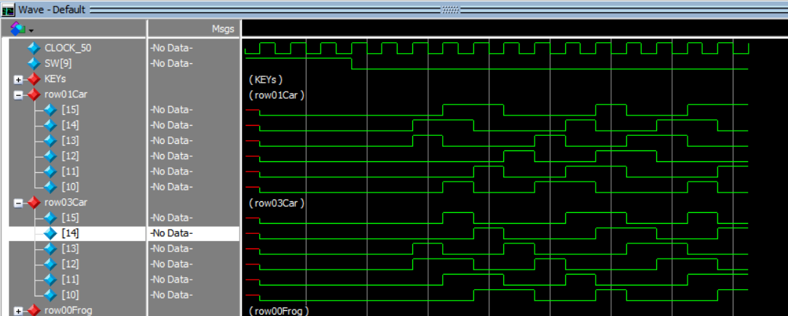
> Fig. 8. Vehicle LEDs Clock Transitions in DE1_SoC Testbench

In the DE1_SoC Testbench, the vehicle movement should have HIGH signals moving from one LED to the adjacent one with each clock cycle. Row 1 has leftward movement while Row 3 has rightward movement of vehicles.

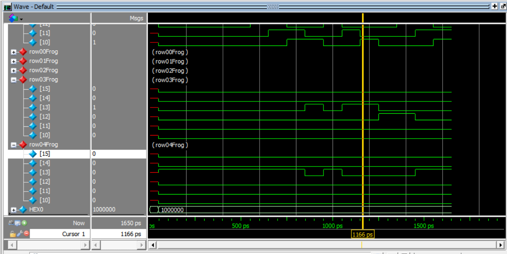
> Fig. 9. Frog Movement after Reset in DE1_SoC Testbench

Frog movement is controlled by button presses, which is observed in the frogLight module below (Fig 10), but when encountering the LED of one of the vehicles (shown in the upper portion of the simulation), the frog light resets back to its initial position.

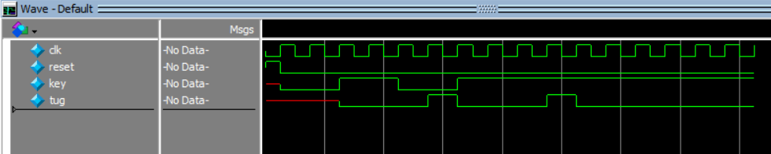
> Fig. 10. inputTug

Each pushbutton input is sent to inputTug to ensure each press was only counted once, even if the button was held down. Therefore, each time key is HIGH, no matter how many clock cycles it is HIGH for, it will only be counted for one clock cycle with the output tug.

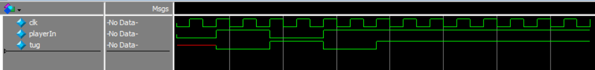
> Fig. 11. inputDejammer

inputDejammer ensures stability by delaying the output by two clock cycles. Output tug follows playerIn after two clock cycles.

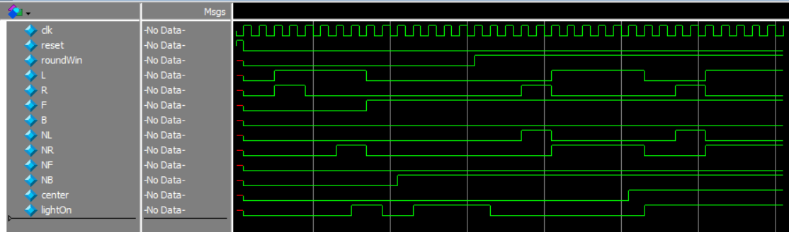
> Fig. 12. frogLight

frogLight demonstrates the functionality of each individual LED that the frog travels to in the 5x6 playfield on the LED Array. L, R, F, and B are the buttons pressed (Left, Right, Forward, Back), and NL, NR, NF, and NB represent the adjacent LEDs to the current frogLight. If a button is pressed but no adjacent lights are on, the light does not turn on (lightOn is LOW). If a button is pressed and the opposing direction adjacent light is on, then lightOn goes HIGH. If the round is won (roundWin is HIGH), but the light is not a center light, then the light should turn off. If it is a center light, then the light should turn on.

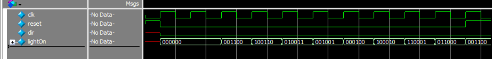
> Fig. 13. normalLight

normalLight illustrates the animated movement of the cars. The first few transitions are shown for when dir is LOW, meaning rightward movement. lightOn represents a single row on the LED Array where the cars travel. With each clock cycle, the LEDs that are active shift to the right, with any LED on the right edge appearing on the left in the next transition for cyclical behavior.

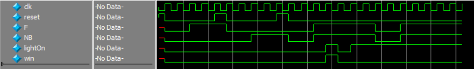
> Fig. 14. victoryLight

victoryLight is controlled mostly by the forward button and the light just below it. There is an individual victoryLight for each LED in the uppermost row of the LED Array. Whenever the light below (NB) is on and the forward button is pressed (F), the victoryLight LED turns on and outputs a win. Only one win should occur between each reset if conditions are satisfied.

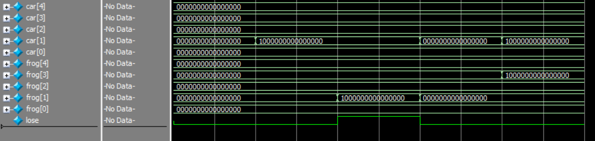 
> Fig. 15. loseChecker

loseChecker checks for when the position of the frog is the same as the position of a car by comparing each row of the LED Array. When the positions do not match, the round should continue. However, if both match (such as with 10000…. And 10000….) within the same row, then a loss should be output. If both are HIGH but are in different positions, such as in different rows with the last testcase, then a loss should not be recorded.

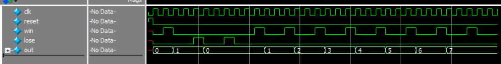
> Fig. 16. counter

counter increments by 1 every time win is HIGH and decrements by 1 every time lose is HIGH. The value of out has a maximum of 7 and a minimum of 0, meaning that if a loss is recorded when out is 0, out will remain 0. If a win is recorded when out is 7, out will remain 7.

### Generalized Resource Utilization by Entity Report:
The generalized resources utilized to implement the Frogger design are shown in Table 1. The most amount of gates in the overall design are in LEDDriver, which is necessary to use the LED Array attachment with the De1-SoC board. Following LEDDriver is clock_divider, necessary to divide the clock into a smaller frequency to slow the speed of the vehicles in comparison to the frog (so that the frog may have a chance to cross the road). Otherwise, most gates are used in normalLight, which controls an entire row and has multiple states to specify the LEDs. An individual victoryLight required the fewest, as they had very few inputs to determine logic and states. To minimize the design’s usage of resources, minimal flip flops were added, as well as gate-level implementations of some of the system’s elements, to ensure minimal logic gates being used for certain functions.

### Table 1. Number of Gates Used by Module (Generalized)
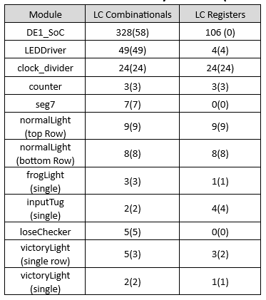

## Reflection
In the future for embedded systems classes, I will be thinking a lot more about resource utilization. Since the first few labs in EE 271, I gradually learned how to try to minimize the size of my circuits and methods to check and reduce them. This included finding alternative ways to implement certain behavior and switching to gate-level implementation to enforce a certain amount of gates. In future embedded systems classes, I’m sure I’ll be learning more about how to reduce resources used and am eager to improve my understanding of programming these circuits.

I believe that through a lot of troubleshooting, with lots of trial and error, I improved my understanding of how programming in Verilog translates to hardware. This is most seen with specifying which pin goes where for each module. With this lab especially, I struggled to map connections between modules and internal logic to prevent linking one input from two different assignments, especially within generate statements. By focusing on interconnectedness through previous labs and this one, I believe I’ve come to understand it much better than initially.

In labs, I struggle most with making progress in the very beginning. Afterwards, I find that once I have some ideas of what to do, I can move forward quickly, with necessary troubleshooting afterwards. However, drafting what to do first has generally been difficult. I’m unsure of which implementation is the most efficient, and usually I cannot foresee the complications I may have with my initial implementation, which may lead to even longer periods of troubleshooting. I’m hoping that in the future when I become more practiced with designing circuits that I may be able to approach this stage of starting designs more confidently. Otherwise, I think I have learned a good process for programming large projects in Verilog. Following my difficulty with the initial stage, I am usually able to build smaller parts before working to the larger project successfully after verifying each step of the way. This helps reduce troubleshooting time when possible.

As I progressed through the EE 271 labs and encountered more than one finite state machine or combinational logic block, I learned that it was very important to understand and map out where the inputs and outputs for each module (or machine/combinational logic) was going. For each lab, I made sure to draft out my ideas through paper and pencil before doing the block diagram. I wanted to ensure that I had a good idea of what to do, since working with more than one finite state machine generally made the process more confusing. I will likely continue my method of drafting before the block diagram in future embedded systems classes to try to understand the lab better before proceeding.

## Appendix
### Resource Utilization by Entity 
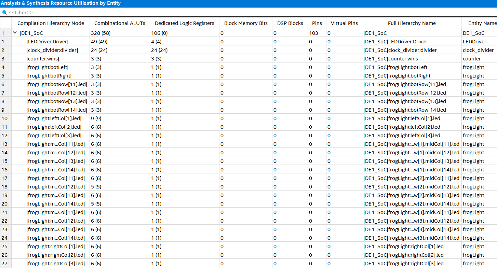
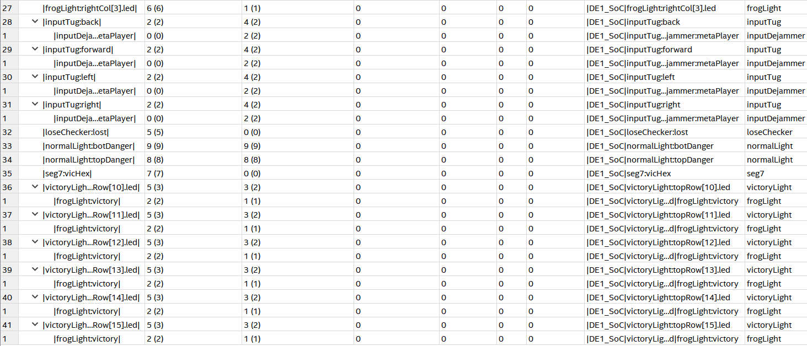

## Modules:
1.	DE1_SoC:
- The DE1_SoC module is the top level-entity in the design. This module overall controls the output LED Array, as well as the HEX0 display on the De1 SoC board. The output is controlled from the input signals of 4 buttons, KEY[3], KEY[2], KEY[1], and KEY[0], and switch SW[9]. The DE1_SoC controls a travelling green LED starting in the fifth row (from the top) of the LED Array board that represents a frog. The frog must navigate past orange LED cars in the above rows to reach the top row without encountering the cars. The behavior of the circuit originates from the modules instantiated in the DE1_SoC module, which are listed below.
2.	inputTug:
- Instantiated four times in DE1_SoC, one for each used keybutton. Receives user input from keybuttons and checks whether it is occurred on a clock edge, or missed the clock edge, and ensures that a single button press only counts as one press, even if held over several clock cycles.
3.	inputDejammer:
- Instantiated within inputTug is inputDejammer, which receives the user input from inputTug and connects this input to two flip flops to ensure a stable input for the rest of the system, which also ensures stable outputs.
4.	frogLight:
- Instantiated 30 times within the DE1_SoC module to cover the 5x6 used section of the LED Array. The frogLight module controls frog movement over the playfield, turning the current light on or off depending on which buttons are pressed (as received by the outputs of inputTug) and whether the adjacent lights are on. This module is used for the starting light that the frog resets to on a new game and is also instantiated once per victory light described below. Upon reset, if the light is specified to be a center light, then it will turn on. Otherwise, it will turn off. If a round is completed, meaning one round was won by a player, it will turn off unless it is a designated center light, then it will turn on.
5.	normalLight:
- Instantiated twice in the DE1_SoC module, one for the 1st and 3rd row of the LED Array (with the topmost being the 0th). Controls car movement on the LED Array by controlling a single row and changing the direction of LEDs turning on depending on an input parameter specifying direction. The cars move automatically across the row. Will turn off while reset is active, before returning to “animated” movement across the row after reset.
6.	victoryLight:
- Instantiated six times in DE1_SoC to control the top row of the LED Array. Also contains an instantiated frogLight as mentioned above to turn LED on (briefly, since the frog is promptly sent back to start) when the frog moves to it. Also checks if a win occurs, depending on whether the forward button is pressed and if the light below the victory light is on and is only green (the frog and not a car). If there is a win, the output is later sent to module counter instantiated in DE1_SoC to increment the number of wins for that player, with a maximum of seven wins.
7.	loseChecker:
- Instantiated once within DE1_SoC. Checks the positions of the car and the frog for whether they occupy the same LED following a button press. If they do, a loss is output, which will later be sent to module counter instantiated in DE1_SoC to decrement the number of wins for that player, reducing to no less than 0 wins.
8.	counter:
- Instantiated within the DE1_SoC module. Takes output from victoryLight and loseChecker on whether there was a win or loss and updates the total amount of wins a player has, with a maximum of seven and a minimum of 0. Sends output to instantiated seg7 module in the DE1_SoC module, which updates result to HEX0 on the De1-SoC board.
9.	seg7:
- Instantiated within the DE1_SoC module is the seg7 module, which assigns case-by-case the HEX display depending on how many times a player has won. A maximum of 7 rounds are won before no more wins are recorded and a minimum of 0 wins are recorded.
10.	clock_divider:
- Instantiated within the DE1_SoC module. Is used to modify the clock frequency of the system and the vehicles on the LED Array. The system clock controls most functionality, including the frog movement, button presses, and resets. The clock for the vehicles is much slower, to allow the frog to potentially reach victory.
