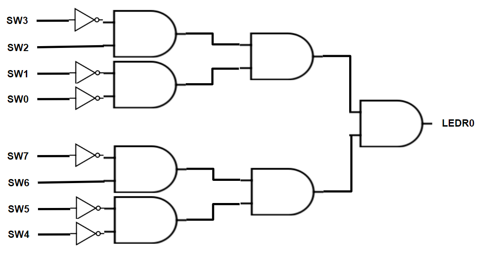
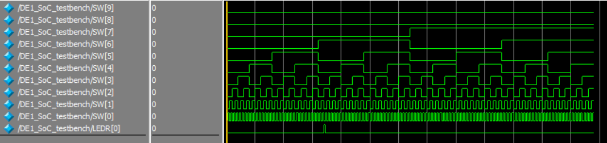
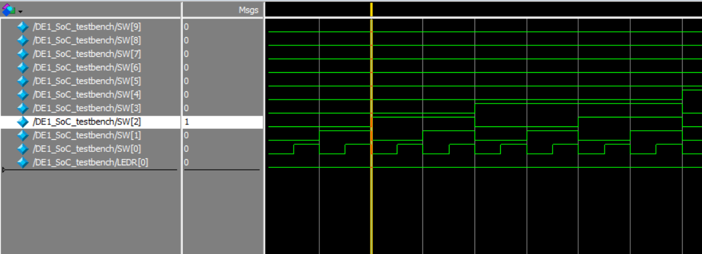
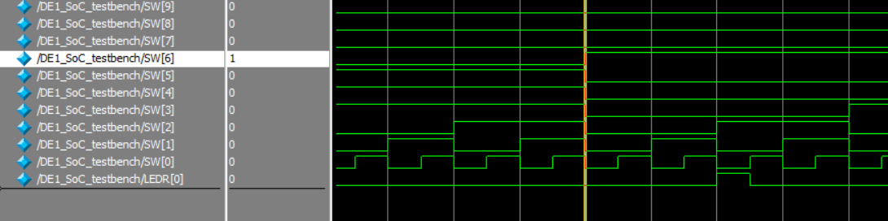
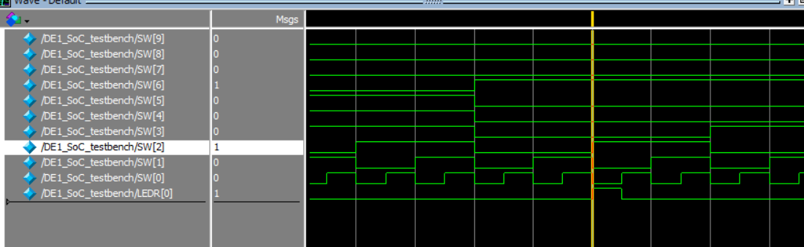
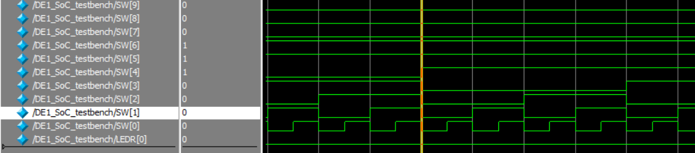

# Lab 2
This lab was focused on using the physical breadboard on the DE-1 SoC board for connections lighting an LED for specifically one combination of switch inputs. Therefore, the module's code is very simple.

## Design Problem #1 Schematic

> Figure 1.

## Design Problem #2 Schematic

> Figure 2.

## Design Problem #2 Simulations

> Figure 3. Input combinations result in LED LOW

Full results for every possible input combination for SW[0]…SW[9]. The output, LEDR[0] remains at low except for one input.
 

> Figure 4. Input combinations continue to result in LED LOW

Input of high on SW[2], corresponding to last digit of student number. LEDR[0] remains at low.
 

> Figure 5. Input combinations continue to result in LED LOW except for SW6 being HIGH

Input of high on SW[6], corresponding to second to last digit of student number. LEDR[0] remains at low.

> Figure 6. Input combinations continue to result in LED HIGH

Input of high on both SW[6] and SW[2]. LEDR[0] is now set to high.

> Figure 5. Random input combination of switches

Randomly chosen input combination of switches. LEDR[0] is at low.

## Modules:
1. DE1_SoC
- The DE1_SoC module is the top level-entity in the design. This module controls the output,
LEDR[0], from the input signals of 8 total switches, SW[0] to SW[7]. If the input signal from
all 8 switches matches the last two digits of my student number, which is 44, then the
output to LEDR[0] will be high. Otherwise, the output will be low. The logic of the output is
controlled by multiple ANDs and NOTs. Additionally, the HEX display on the DE-1 SoC board
is reset to default, where it is turned off.

2. DE1_SoC_testbench
- Within the DE1_SoC module is the DE1_SoC_testbench() module, which tests every possible
combination of inputs from the 8 total switches used in DE1_SoC module.