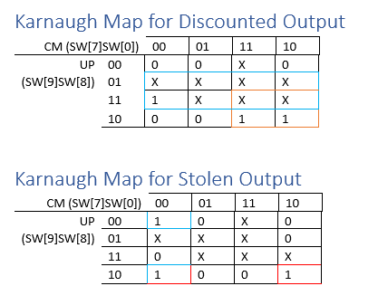

# Lab 3

## Design Problem
Scanners for item returns are useful for determining whether the item was sold with a discount (and therefore should be refunded at the corresponding price) or if the item was potentially stolen. At Nordstrom, items are tracked by their UPC code, which determines whether the item is on a discount and whether it is an expensive item. Scanning the UPC code will determine whether the item is on discount, but determining whether it is stolen requires an extra input: a marker on expensive items that have been purchased. Therefore, if an expensive item is scanned without a marker, then it must have been stolen. This effectively reveals anyone attempting to return an expensive item that was stolen. This system design takes in four total inputs, three of which being the UPC code combination, and the fourth input being the secret marker placed on purchased expensive items. There are two outputs, one indicating whether the item is on discount or not, and the second output indicating whether the item was stolen or not. Overall, this system will indicate if a scanned item is on discount, and additionally, if it was a stolen expensive item.

## Methods
The price scanner was designed using basic logic gates including AND, NAND, OR, and NOR. To implement the design, a truth table was constructed from the description of the assignment, where each combination of inputs has outputs determined to be true or false. Each combination of inputs, which are the different UPC codes, as well as whether the item is marked or not, has two outputs. One output is whether the item is on discount or not, and the second output is whether the item was stolen or not. From the truth table, two Karnaugh Maps were constructed, one for both outputs Discount and Stolen. Each Karnaugh Map has four inputs, being U, P, C, which altogether are the item code, and M, which represents whether the item is marked or not. The data for the Karnaugh Maps was transferred from the truth table, and simplifies the process to find an expression for the system. Ones (true values) in the Karnaugh Maps were grouped together, with the largest possible amount of elements within the smallest number of groups, and a Sum of Products expression was made from the groupings for both Karnaugh Maps, where the expression is built off of the true values in the Karnaugh Map.  The expression was then simplified, and a gate-level schematic was constructed to illustrate the design. The gates were then programmed in Verilog in a module at the gate level with an accompanying testbench to test all possible combinations of inputs. The Verilog implementation was then verified with ModelSim using the testbench, before being uploaded into the Altera DE1-SoC Board to further simulate the system.

> Figure 1. Karnaugh Maps for Boolean Logic

> Figure 2. Schematic for Discounted Output
 

> Figure 3. Schematic for Stolen Output
 
## Modules:
1.	DE1_SoC
- The DE1_SoC module is the top level-entity in the design. This module controls the outputs, LEDR[9] and LEDR[8], from the input signals of 4 total switches, SW[9], SW[8], SW[7], and SW[0]. If the input signal from the first three switches matches the UPC code for one of the given Nordstrom products that are discounted, then the output to LEDR[9] will be high. Otherwise, the output will be low. If the item is also expensive, as determined by the UPC code, and SW[0] is low, then the output to LEDR[8] will be high, indicating that the item was stolen. SW[0] represents the mark for purchased expensive items, so if SW[0] is low, then no mark was found. If SW[0] is high, then the mark was found and the item was not stolen and output to LEDR[8] would be low. The logic of the output for whether an item is on discount or not is controlled by two gates: an AND and an OR. The logic of the output for whether an item was stolen is controlled by four gates: OR, NOR, AND, and NOT. 
2.	DE1_SoC_testbench
- Within the DE1_SoC module is the DE1_SoC_testbench() module, which tests every possible combination of inputs from the 4 total switches used in DE1_SoC module.
