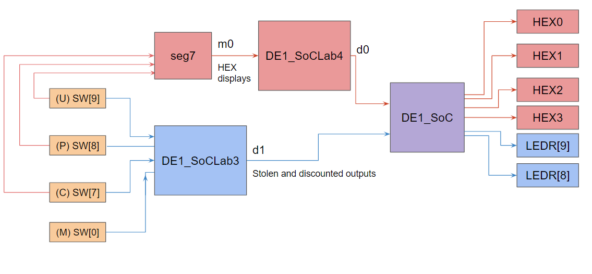
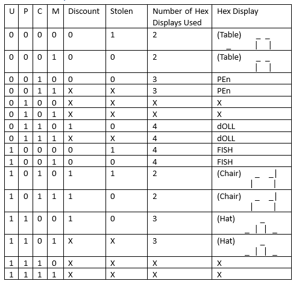
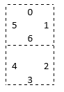
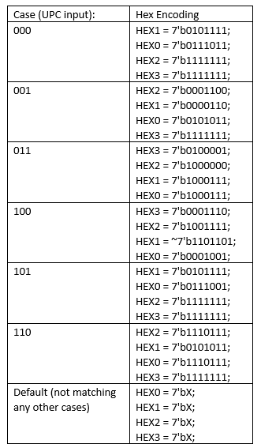

# Lab 4 - Extension of Lab 3
This lab is an extension of Lab 3, using the HEX displays to illustrate items I choose to represent with codes in the scenario of Lab 3.

> Figure 1. Block-Level Representation of Design

> Figure 2. HEX Displays for each item

> Figure 3. HEX Display Map

Using the above reference as a guide, and matching with the order of positions in 7-bit binary: 6543210, the different segments for the Hex display can be controlled. Since the HEX display is ACTIVE LOW, a LOW (0) at a position would keep that segment on while a HIGH (1) would turn it off. If the output does not matter, then the 7-bit equivalent of X, which is 7’bX is used instead. For outputs with less than four hex displays needed for the description, the rest of the unused HEXs are set to HIGH, to not confused with “don’t matter” outputs.

> Figure 4. HEX Encodings

## Modules:
1.	DE1_SoC:
- The DE1_SoC module is the top level-entity in the design. This module overall controls the output LEDs LEDR[9], LEDR[8], as well as four of the Hex displays on the De1 SoC board, HEX0, HEX1, HEX2, and HEX3. The output is controlled from the input signals of 4 total switches, SW[9], SW[8], SW[7], and SW[0]. The behavior of the circuit originates from the modules instantiated in the DE1_SoC module, which are DE1_SoCLab4 (which includes an instantiated seg7 module) and DE1_SoCLab3.
2.	DE1_SoC_testbench:
- Within the DE1_SoC module is the DE1_SoC_testbench() module, which tests every possible combination of inputs from the 4 total switches used in DE1_SoC module.
3.	DE1_SoCLab4:
- The DE1_SoCLab4 module individually controls four output Hex displays on the De1 SoC board, HEX0, HEX1, HEX2, and HEX3. The output is controlled from the input signals of 3 switches, SW[9], SW[8], and SW[7]. If the input signal from the first three switches matches the UPC code for a product in the catalog, then a description will appear on the HEX displays corresponding to the input UPC code. The output for the Hex displays is determined case-by-case by the unique UPC code given, programming the individual segments of the Hex display for a proper description.
4.	The DE1_SoCLab4_testbench:
- Within the DE1_SoCLab4 module is the DE1_SoCLab4_testbench() module, which tests every possible combination of inputs from the 3 total switches used in DE1_SoCLab4 module.
5.	seg7:
- Instantiated within the DE1_SoCLab4 module is the seg7 module, which assigns case-by-case the Hex display depending on the UPC code given by the three switches: SW[9], SW[8], and SW[7].
6.	DE1_SoCLab3:
- The DE1_SoCLab4 module individually controls the output LEDs LEDR[9], LEDR[8]. The output is controlled from the input signals of 4 switches, SW[9], SW[8], SW[7], and SW[0]. If the UPC code is one of the products that are discounted, then the output to LEDR[9] will be high. Otherwise, the output will be low. If the item is expensive, as determined by the UPC code, and SW[0] is low, then the output to LEDR[8] will be high, indicating that the item was stolen. The logic of the output for whether an item is on discount or not is controlled by two gates: an AND and an OR. The logic of the output for whether an item was stolen is controlled by four gates: OR, NOR, AND, and NOT.
7.	DE1_SoCLab3_testbench:
- Within the DE1_SoCLab4 module is the DE1_SoCLab4_testbench() module, which tests every possible combination of inputs from the 4 total switches used in DE1_SoCLab4 module.
