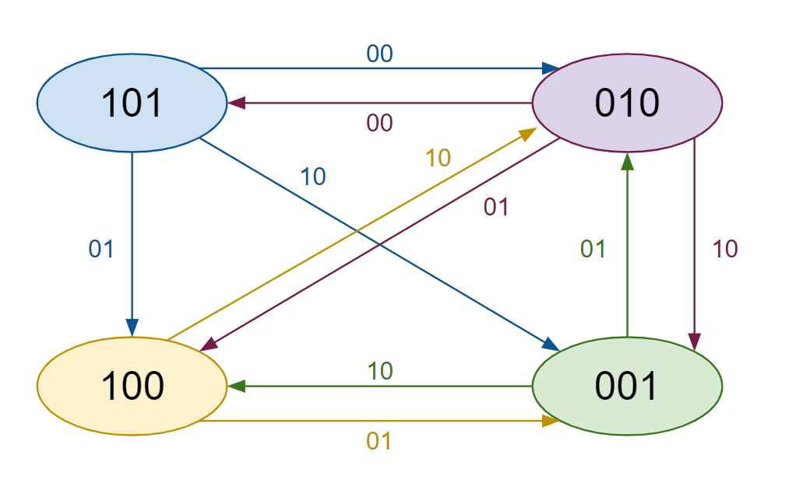
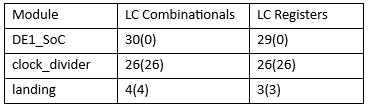
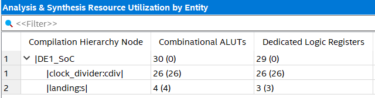

# Lab 5
## Design Problem
Indicators for wind direction on the SeaTac runway is crucial for planes to land safely. Therefore, when the landing lights are inoperable, the system must be quickly replaced to ensure landing safety. At the end of all runways should be three distinct indicators: calm, right to left, and left to right winds. This way, the pilot knows how to adjust their landing. Depending on two inputs, the light indicators will alternate between different states to reflect the wind direction. For calm winds, there will be two states, with central the central LED lighting up, and then the outer LEDs lighting up (with the center turned off) before repeating. For right to left winds, the light “moves” across the LEDS by going in sequence from right to left of having just one LED lit. For left to right winds, the light does the same as right to left winds but in the opposite direction. The state of wind can be changed at any time by modifying the switches. If there is a need to reset the system, an additional input is used to reset the system to a single state for as long as the input is active. Otherwise, the system continually alternates between LEDs as outputs.

> Figure 1. System State Diagram

> Figure 2. Number of Gates Used

## Methods
The light system was designed by identifying the different states the lights could be in, and seeing what the next state for the light should be depending on the inputs. For example, to represent calm winds with both switches off (in default), the lights should alternate between two states: one LED lit in the center, and then the outer LEDs lit with the center unlit. The possible states and what combination of inputs could transition between them was illustrated with a state diagram. Each circle represents a state, where a 1 indicates a lit LED and a 0 indicates an unlit LED. The arrows accompanied by two numbers are the input switches, with a 0 indicating a switch turned off and a 1 indicating a switch turned on. This state diagram was implemented in Verilog and verified with ModelSim using a testbench before being uploaded into the Altera DE1-SoC Board to further simulate the system. Furthermore, a state table was constructed from the state diagram to verify results once again, this time accounting for any states or combination of inputs that would not occur in this situation (such as all lights on, or all switches on), and making sure these extraneous results did not affect the system. Finally, the size of the system was optimized by having the fewest number of states with the fewest number of transitions between them while still following the design problem. In the second figure is a representation of the space used for each module as seen by the resource utilization page in Verilog.

> Figure 3. Resource Utilization By Entity

## Modules:
1.	DE1_SoC:
- The DE1_SoC module is the top level-entity in the design. This module overall controls the output LEDs LEDR[9], LEDR[2], LEDR[1], LEDR[0] on the De1 SoC board. The output is controlled from the input signals of 2 switches, SW[1], SW[0], and the pushbutton KEY[0]. The behavior of the circuit originates from the modules instantiated in the DE1_SoC module, which are landing and clock_divider.
2.	DE1_SoC_testbench:
- Within the DE1_SoC module is the DE1_SoC_testbench() module, which tests every possible combination of inputs from the 2 total switches and single pushbutton used in DE1_SoC module.
3.	landing:
- Determines the output to the LEDR[2:0] through the combination of input switches, SW[1] and SW[0]. This is also dependent on the current state of the circuit, as this module determines the next state. 
4.	landing_testbench:
- Within the landing module is the landing _testbench() module, which tests combinations of inputs from the 2 total switches used in landing module.
5.	clock_divider:
- Allows for the clock cycles to appear more visibly on the DE1-SoC board by dividing the on-board FPGA clock at 50 Mhzto multiple levels, with the length of the clock increasing by one each time.

