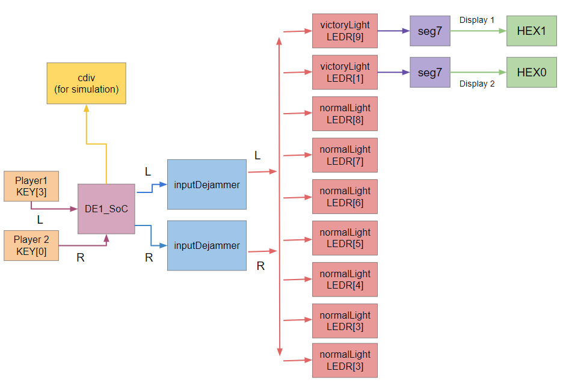
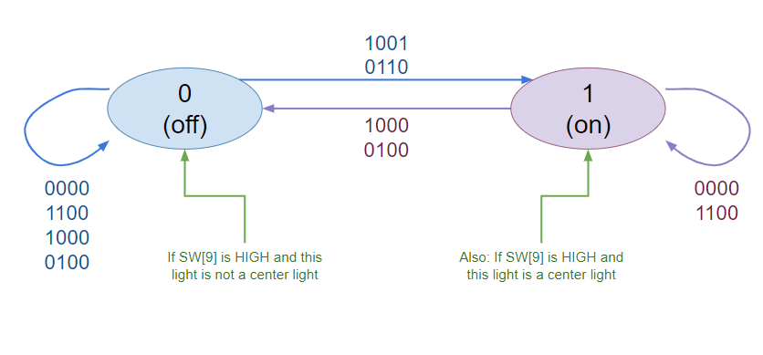
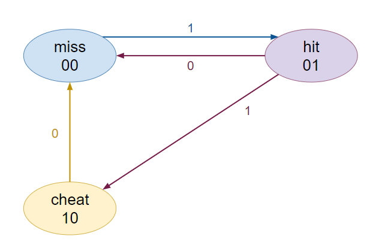
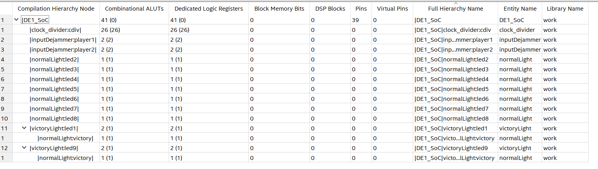

# Lab 6

> Fig 1. Block Diagram of System

This diagram illustrates how the two player inputs, KEY[3] and KEY[0] are used or transferred into each module to control the LEDRs. Note that cdiv is a module only used for controlling the clock in simulation, and therefore does not directly link to other modules except for DE1_SoC.

## Design Problem
Currently, Tug O’War is best known as pulling a rope between two groups or individuals with the goal of pulling the center of the rope completely over to one side of players. The side the rope is pulled over are the winners.

A digital version involving the DE1-SoC board allows for two players to press buttons to moving a light from the center over to one side completely. They each repeatedly press their button to represent tugging on the rope. If the light moves completely over past the other side, the player on that side is victorious. The player’s number is then displayed on the HEX display on the DE1-SoC. With a 1 corresponding to a player 1 win (the left side) and a 2 corresponding to a player 2 win (the right side). Player 1’s side is controlled by KEY[3] button and Player 2 is controlled by the KEY[0] button. The LEDRs from 1 through 9 are the playfield, where center light LEDR5 is pulled left or right depending on which player successfully “tugs” the light to their side. If player 1 presses their button while player 2 does not, the light will shift to their side by one (from game start: LEDR[5] to LEDR[6]). If player 2 presses their button while player 1 does not, the light will shift to their side by one (from game start: LEDR[5] to LEDR[4]). If both buttons are pressed at the same time, there is no movement. Players must tap the button repeatedly to try to get the light fully past their side. Players are also prevented from pressing the button continuously.

## Methods
### System Design
The system inputs and outputs are controlled by the leading edge of a 50 MHz clock. Button presses are counted only if the button was pressed over a clock edge. The light will only ever move on a clock edge. This control over timing also ensures the button cannot be held down over multiple clock edges to count for multiple button taps, but instead just one.

When the light is moved off of the playfield from LEDR[1], player 2 is the winner. The same occurs for player 1 but for LEDR[9]. The winner is then displayed on the HEX display with the player number of whoever won. Upon reset, LEDR[5] is lit until a player presses their button on a clock edge.

To control which LED is on, each LED is controlled by a module with inputs of L and R (whether the left or right button was pressed), and whether the next left and next right (NL and NR) lights are currently on. From this, the two states of whether a light is on or off can be determined.

> Fig 2. The state diagram for each playfield light, where it can be either on or off.

In Fig 2., a state diagram is used to convey the different states a playfield light can be in and what inputs may cause them to change.  The order of the four-digit input is L, R, NL, and NR, where 0 represents a signal that is LOW and 1 represents a signal that is HIGH.

For an example case, if the light is currently off, but L is high (such that player 1 pressed their button) and NR is high, meaning that the next right light is on, then the light will turn on.

A center light has this functionality as well, but has separate logic that triggers on reset and not dependent on the button presses or adjacent lights (depending only on SW[9]), turning the light on. Therefore, if this is not the center light, then the light will turn off.

> Fig 3. The state diagram for the inputDejammer, which takes the user input and determines whether it is a miss, a valid hit, or a cheat (pressing button continuously)

In Fig 3., a state diagram is used to convey the different states for what an input can be designated as. This eventually controls whether the lights will be “tugged” or not.

These state diagrams were later transferred into Verilog to be simulated and then input into the DE1-SoC board. Furthermore, the design was minimized for number of gates, which is illustrated below in the Resource Utilization by Entity report.

### Resource Utilization by Entity Report:
The resources utilized to implement the Tug O'War design are shown in Figure 3. The most amount of gates in the overall design are in cdiv, which is used exclusively for simulation. Otherwise, the majority of gates are used in the inputDejammer, which ensures that user input is on a clock edge, and victoryLights, which also control the hex displays. Each individual light required the fewest, as they had very few states and very basic logic for whether the light was on or off.

> Fig 4. Resource Utilization by Entity

Displays resources used by each module involved in the design, under the top-level module DE1_SoC

## Modules:
1.	DE1_SoC:
- The DE1_SoC module is the top level-entity in the design. This module overall controls the output LEDs LEDR[9] through LEDR[1], as well as the HEX0 and HEX1 displays on the De1 SoC board. The output is controlled from the input signals of 2 buttons, KEY[3], KEY[0], and the switch SW[9]. The behavior of the circuit originates from the modules instantiated in the DE1_SoC module, which are listed below.
2.	DE1_SoC_testbench:
- Within the DE1_SoC module is the DE1_SoC_testbench() module, which tests possible combinations of inputs from the 2 buttons as well as the reset switch used in DE1_SoC module.
3.	inputDejammer:
- Receives user input from the pushbuttons and determines whether it was on a clock edge or not, as well as if the button is pressed continuously and is therefore a cheat. If the button press is valid, it is sent to further submodules to transfer to output.
4.	inputDejammer_testbench:
- Within the inputDejammer module is the inputDejammer _testbench() module, which tests combinations of inputs from button presses used in inputDejammer module.
5.	normalLight:
- Controls normal playfield light functionality, turning the light on or off depending on which buttons are pressed (as received by the inputDejammer) and whether the adjacent lights are on. This module is used for both the center light and the victory lights. Upon reset, if the light is specified to be a center light, then it will turn on. Otherwise, it will turn off.
6.	normalLight_testbench:
- Within the normalLight module is the normalLight _testbench() module, which tests combinations of inputs from button presses used in normalLight module.
7.	victoryLight:
- Controls victory (edge) playfield light functionality, therefore checking if a win will occur, depending on the button presses (from inputDejammer) and if the adjacent light is on. If there is a winner, the result is sent to seg7 to display the winner on the HEX display.
8.	victoryLight_testbench:
- Within the victoryLight module is the victoryLight _testbench() module, which tests combinations of inputs from button presses used in normalLight module to see if victory is properly displayed. Also includes an instantiated normalLight module for basic functionality of turning the light on and off as well as checking if the adjacent light is on.
9.	seg7:
- Instantiated within the victoryLight module is the seg7 module, which assigns case-by-case the Hex display depending on who the winner is, either player 1 or player 2. Therefore, displaying a 1, or 2, depending on the winning player.
10.	clock_divider:
- Allows for the clock cycles to appear more visibly in simulation by dividing the clock at 50 Mhz to multiple levels, with the length of the clock increasing by one each time.

