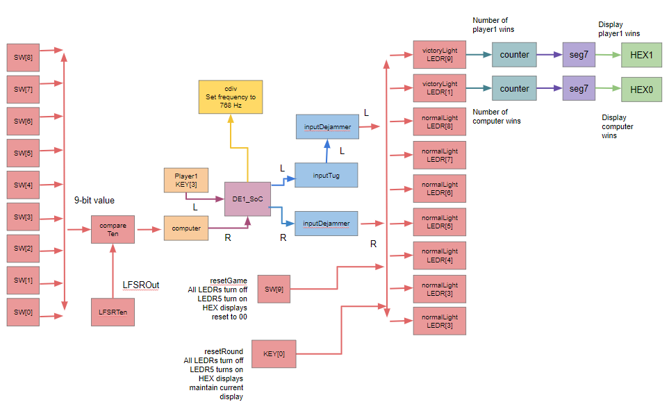
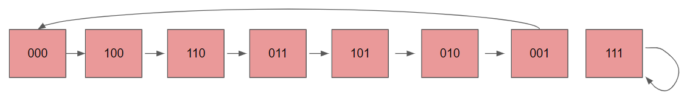
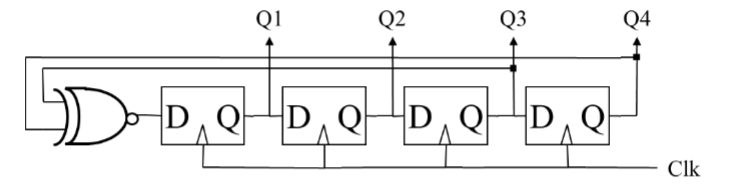
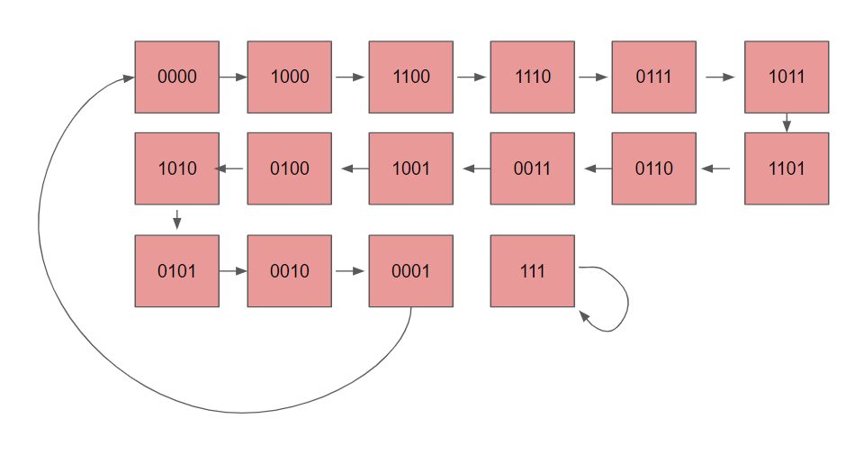
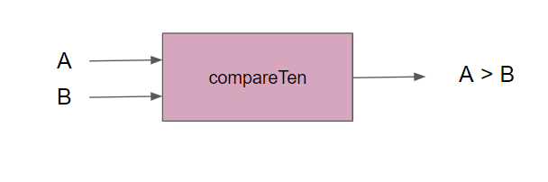
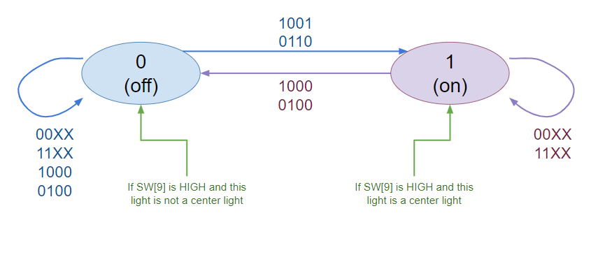
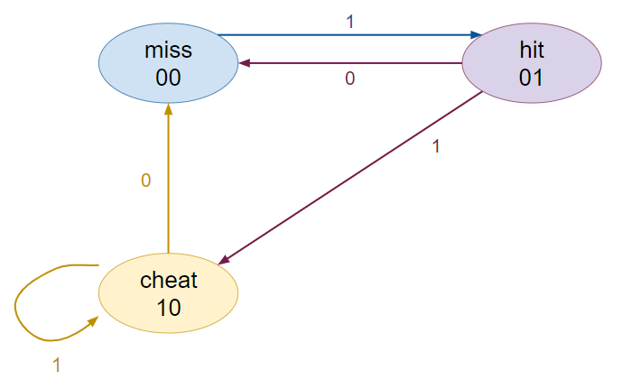
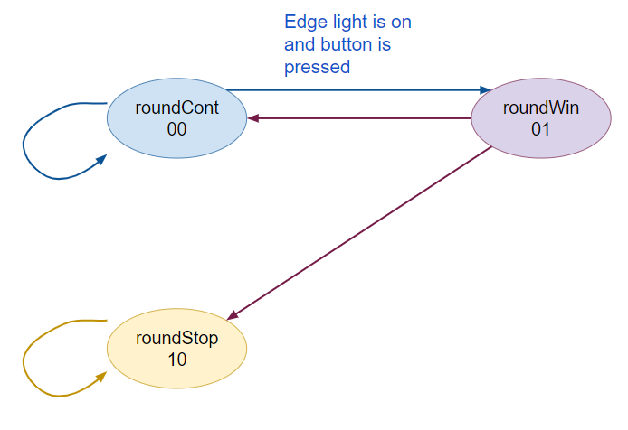
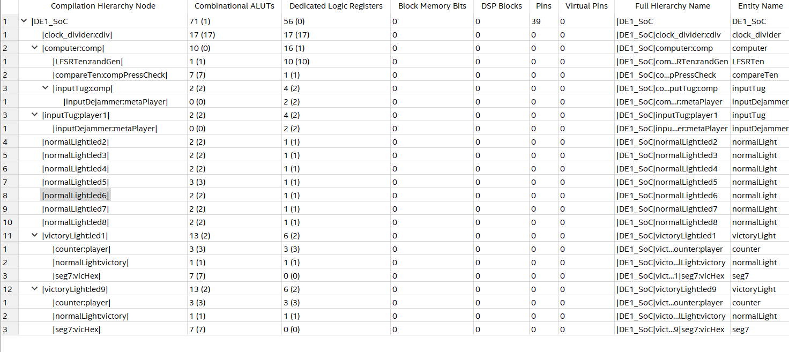

# Lab 7

> Fig 1. Block Diagram of System

This diagram illustrates how the two player inputs, KEY[3] and the randomized number as well as the switch combination for the computer, are used or transferred into each module to control the LEDRs.
## Design Problem
Currently, Tug O’War is best known as pulling a rope between two groups or individuals with the goal of pulling the center of the rope completely over to one side of players. The side the rope is pulled over are the winners.

A digital version involving the DE1-SoC board allows for one player and a computer competitor to press (or, for the computer, simulate pressing) buttons to move a light from the center over to one side completely. Repeatedly pressing the button represents tugging on the rope. If the light moves completely over past the other side, the player on that side is victorious. The player’s win count is displayed on the HEX display on the De1-SoC. The count increases with each round won, with a maximum of seven wins. The left hex represents player 1 wins with the right hex representing player 2, the computer, wins. Player 1’s side is controlled by KEY[3] button and Player 2 is controlled by a computer. The LEDRs from 1 through 9 are the playfield, where center light LEDR5 is pulled left or right depending on which player successfully “tugs” the light to their side. If player 1 presses their button while player 2 does not, the light will shift to their side by one (from game start: LEDR[5] to LEDR[6]). If player 2 presses their button while player 1 does not, the light will shift to their side by one (from game start: LEDR[5] to LEDR[4]). If both buttons are pressed at the same time, there is no movement. Players must tap the button repeatedly to try to get the light fully past their side. Players are also prevented from pressing the button continuously.

## Methods
### System Design
The system inputs and outputs are controlled by the leading edge of a 768 Hz clock. Button presses are counted only if the button was pressed over a clock edge. The light will only ever move on a clock edge. This control over timing also ensures the button cannot be held down over multiple clock edges to count for multiple button taps, but instead just one. Additionally, player input is run through two flip-flops to ensure stable inputs (and therefore outputs).
When the light is moved off of the playfield from LEDR[1], player 2 is the winner. The same occurs for player 1 but for LEDR[9]. The win count for the winning player is then increased by one on the HEX display. Upon round reset, which is pressing KEY[0], the win count is maintained but another round can be played. The game is reset with SW[9], which will set the win count to 0 for both players. Upon both resets, LEDR[5] is lit until a player presses their button on a clock edge.

### Computer Input
Below are the circuit designs and state diagrams for 3-bit and 4-bit LFSRs. These were first analyzed to later apply and design a 10-bit LFSR in Verilog. The 10-bit LFSR was then used to generate random numbers for the computer player.
 

> Fig 2. 3-bit LFSR circuit design and state diagram 

> Fig 3. 4-bit LFSR circuit design and state diagram

> Fig 4. Block diagram of compareTen, a 10-bit comparator that took the input of a randomly generated number, which is the 10-bit LFSR applying an expanded version of the 3-bit and 4-bit LFSRs above, and the input from the switches on the De1-SoC board.

### Both Player Input
To control which LED is on, each LED is controlled by a module with inputs of L and R (whether the left or right button was pressed), and whether the next left and next right (NL and NR) lights are currently on. From this, the two states of whether a light is on or off can be determined.

> Fig 5. The state diagram for each playfield light, where it can be either on or off.

In Fig 5., a state diagram is used to convey the different states a playfield light can be in and what inputs may cause them to change.  The order of the four-digit input is L, R, NL, and NR, where 0 represents a signal that is LOW and 1 represents a signal that is HIGH.

For an example case, if the light is currently off, but L is high (such that player 1 pressed their button) and NR is high, meaning that the next right light is on, then the light will turn on.

A center light has this functionality as well, but has separate logic that triggers on reset and not dependent on the button presses or adjacent lights (depending only on SW[9]), turning the light on. Therefore, if this is not the center light, then the light will turn off.

> Fig 6. The state diagram for the inputTug module, which takes the user input and determines whether it is a miss, a valid hit, or a cheat (pressing button continuously). A 1 represents that the button is pressed, and 0 means unpressed.

In Fig 6., a state diagram is used to convey the different states for what an input can be designated as. This eventually controls whether the lights will be “tugged” or not.

> Fig 7. The state diagram for victoryLight, other than its states from normalLight. These states ensure that after a player has won the round that the round will end and no further changes can be made to the playfield. The only method to get out of roundStop is to reset the round, moving the game forward for another player to score.

In Fig 7., a state diagram is used to convey the different states for what the victoryLight can be designated as. This overall controls the round ending functionality.

These state diagrams were later transferred into Verilog to be simulated and then input into the De1-SoC board. Furthermore, the design was minimized for number of gates, which is illustrated below in the Resource Utilization by Entity report.

### Resource Utilization by Entity Report:
The resources utilized to implement the Tug O'War design are shown in Figure 3. The most amount of gates in the overall design are in cdiv, necessary to divide the clock into a smaller frequency from 50MHz. Otherwise, the majority of gates are used in victoryLights, which not only has normal playfield light functionality, but also determines the round ending, increments any player wins, and controls the hex displays. Each individual light required the fewest, as they had very few states and very basic logic for whether the light was on or off. To minimize the design’s usage of resources, minimal flip flops were added, as well as gate-level implementations of some of the system’s elements, to ensure minimal logic gates being used for certain functions.
 
### Resource Utilization by Entity

> Fig 8. Resource Utilization by Entity

Displays resources used by each module involved in the design, under the top-level module DE1_SoC

## Modules:
1.	DE1_SoC:
- The DE1_SoC module is the top level-entity in the design. This module overall controls the output LEDs LEDR[9] through LEDR[1], as well as the HEX0 and HEX1 displays on the De1 SoC board. The output is controlled from the input signals of 2 buttons, KEY[3], KEY[0], and switches SW[9:0]. The behavior of the circuit originates from the modules instantiated in the DE1_SoC module, which are listed below.
2.	DE1_SoC_testbench:
- Within the DE1_SoC module is the DE1_SoC_testbench() module, which tests possible combinations of inputs from the button as well as the switches used in DE1_SoC module.
3.	inputTug:
- Receives user input and checks whether it is occurred on a clock edge, or missed the clock edge, and ensures that a single button press only counts as one press, even if held over several clock cycles.
4.	inputTug_testbench:
- Within the inputTug module is the inputTug_testbench() module, which tests if all button presses that occur on a clock edge only count as one press
5.	inputDejammer:
- Instantiated within inputTug is inputDejammer, which receives the user input from inputTug and connects this input to two flip flops to ensure a stable input for the rest of the system, which also ensures stable outputs.
6.	inputDejammer_testbench:
- Within the inputDejammer module is the inputDejammer _testbench() module, which tests combinations of inputs from button presses used in inputDejammer module.
7.	computer:
- The opposing and automated player, computer, is controlled by SW[8:0] on the DE1-SoC board, with SW[1] being the lowest difficulty, and SW[9] being a much greater difficulty. All switches on is the maximum difficulty. Difficulty is determined by how often the computer will simulate a button press.
8.	computer_testbench:
- Within the computer module is the computer_testbench() module, which tests the change in difficulty using the switches and how often the computer will simulate a button press as a result.
9.	LFSRTen:
- Instantiated within the computer module is LFSRTen, which generates a random 10-bit number.
10.	LFSRTen_testbench:
- Within the LFSRTen module is the LFSRTen_testbench module, which checks the first 20 numbers generated and ensures sufficient randomness
11.	compareTen:
- Instantiated within the computer module is compareTen, which compares the randomly-generated number from LFSRTen to the input combination of SW[8:0] on the De1-SoC board. If the switch value is greater than the random number, then the output is HIGH.
12.	compareTen_testbench
- Within the compareTen module is the compareTen_testbench(), which checks outputs are accurate for inputs such as 100 > 90 (TRUE), 10 > 9 (TRUE), 5 > 9 (FALSE).
13.	normalLight:
- Controls normal playfield light functionality, turning the light on or off depending on which buttons are pressed (as received by the inputDejammer) and whether the adjacent lights are on. This module is used for the center light and used in the victory lights. Upon reset, if the light is specified to be a center light, then it will turn on. Otherwise, it will turn off. If a round is completed, meaning one round was won by a player, all lights are maintained off.
14.	normalLight_testbench:
- Within the normalLight module is the normalLight _testbench() module, which tests combinations of inputs from button presses used in normalLight module, as well as testing whether the light stays off after a round is won.
15.	victoryLight:
- Controls victory (edge) playfield light functionality, therefore checking if a win will occur, depending on the button presses from both players and if the adjacent light is on. If there is a winner, the result is sent to module counter to increment the number of wins for that player, with a maximum of seven wins. Then, the result of the counter is sent to seg7 to update the number of wins for the players on the HEX display.
16.	victoryLight_testbench:
- Within the victoryLight module is the victoryLight _testbench() module, which tests combinations of inputs from button presses used in victoryLight module to see if victory is properly displayed. Also includes an instantiated normalLight module for basic functionality of turning the light on and off as well as checking if the adjacent light is on. Also checks whether the HEX displays the accurate number and information for a player win.
17.	counter:
- Instantiated within the victoryLight module is the counter module, which updates the amount of wins a player has, with a maximum of seven, and returns this value.
18.	counter_testbench:
- Within the counter module is the counter _testbench() module, which checks if the output increments by 1 every time a win is recorded.
19.	seg7:
- Instantiated within the victoryLight module is the seg7 module, which assigns case-by-case the Hex display depending on how many times a player has won. HEX1 displays player 1’s win count, HEX2 displays the computer’s win count. A maximum of 7 rounds are won before no more wins are recorded.
20.	clock_divider:
- Allows for the clock cycles to appear more visibly in simulation by dividing the clock at 50 Mhz to multiple levels, with the length of the clock increasing by one each time.
