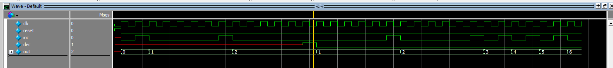

# Lab 1 Report: Parking Lot Occupancy Counter

## Procedure
Task: Parking Lot Counter
This lab was comprised of the task to develop a circuit to track the number of cars in a parking lot by receiving inputs from two sensors at the gate for cars entering and exiting. To complete this, a finite state machine was used to determine the states of the sensors and recognize when a car has completely entered or exited the parking lot (Figure 1). The finite state machine was created from first designing a state diagram, and then programmed using SystemVerilog on Quartus. Results were then simulated on ModelSim and demonstrated on a Field Programmable Gate Array (FPGA), with a virtual DE-1 SoC board.

> Figure 1. State Diagram of sensor readings

Once the state diagram was made, I programmed it into Quartus using SystemVerilog and added necessary logic to ensure that once a car had fully passed through the gate (entered or exited), it was recognized and sent to output.

Additional components of the lab included adding a HEX display, switch control, and LED representation of the cars entering the gate. These were done by using the DE-1 SoC board’s GPIO_0 ports and connecting switches and LEDs from a breadboard. The HEX display is already on the DE-1 SoC board, and therefore was directly programmed to output the current count of cars in the parking lot with System Verilog in Quartus.
 

> Figure 2. Block Diagram of Circuit

The overall design of the circuit is illustrated in Figure 2, with the inputs and outputs of each major module which directly control the DE-1 SoC inputs and outputs. After completely implementing the design in Quartus, results were then verified in ModelSim, before finally being synthesized onto a virtual DE-1 SoC board.
## Results
### Simulation

 
> Figure 3. DE1_SoC module simulation in Modelsim

DE1_SoC module simulations show tests for cars consecutively entering and exiting the parking lot, with varying time spent in the gate (reversing within the gate or going straight through without pause).  Also includes if there is a pedestrian entering the lot, where the count should not update. Expected results are that count increases by one each time a car fully enters the parking lot and HEXs update to match count. When there are zero cars in the lot, HEX5 through 0 should display “CLEAr0” and when there are 25 cars in the lot, HEX5 through 0 should display “FuLL25” and should not go beyond 25 cars.

 
> Figure 4. sensor module simulation in Modelsim

The sensor module simulations show tests for cars consecutively entering and exiting the parking lot, with varying time spent in the gate (reversing within the gate or going straight through without pause).  Also includes if there is a pedestrian entering the lot, where the count should not update. Output is dir, which shows which direction the car came from. If the car is entering, dir should be 10. If the car is exiting, dir should be 01. If the car has neither entered or exited or is not a car, dir should be 00.

> Figure 5. counter module simulation in Modelsim

The counter module simulations show that for every time inc is HIGH, output out increases by one. Additionally, every time dec is HIGH, output out decreases by one.

> Figure 6. hexControl module simulation in ModelSim

The hexControl module simulations show that as count increases, hex0 should update to represent the ones digit number of count. Hex1 should update when the tens digit of count is changed. The limit for count is 25, and therefore, hex values should not change afterwards.

> Figure 7. seg7 module simulation in ModelSim

Seg7 is a submodule in hexControl that displays the numbers for hex0 and hex1 when needed to be updated. The number, count, changes the configuration of the LEDs by whichever segments should be on or off.

> Figure 8. muxnb2_1 module simulation in Modelsim

Muxnb2_1 is a submodule in hexControl for basic logic control to determine what should be displayed to HEX1, either the r of “CLEAr” when there are 0 cars in the lot, or the tens digit for the number of cars in the lot. Muxnb2_1 is a parameterized generation of 2x1 muxes to allow for variable bus inputs. Following a 2x1 mux’s behavior, when sel is LOW, in0 should be sent to output out, and when sel is HIGH, in1 should be sent to output out.

> Figure 9. mux2_1 module simulation in Modelsim

Mux2_1 is a submodule of muxnb2_1 and models a 2x1 mux’s behavior. Therefore, when sel is LOW, in[0] should be sent to output out. When sel is HIGH, in[1] should be sent to output out.

### Final Product
The assigned task was to have a parking lot counter recording the number of cars that were currently in the parking lot, and display the values on the HEX displays of the DE-1 SoC board.

Overall, my circuit performed the task as expected. Every time a car enters or exits the parking lot, passing in front of the two sensors at the gate completely, the count of cars in the parking lot is updated and displayed on the HEXs due to the logic I have implemented in SystemVerilog and verification through ModelSim. Further control of the HEX display and the switches representing the sensors further utilize the capabilities of the DE-1 SoC board, and was also connected and programmed through SystemVerilog in Quartus.

As the task specified, pedestrians do not count towards the overall tally, and neither do cars that started to enter or exit but did not eventually commit. Therefore, my system accurately determines the number of cars in the parking lot that have entered through the gate.

## Appendix
### Code Files:
- DE1_SoC (top level)
- sensor
- counter
- hexControl
- seg7
- muxnb2_1
- mux2_1
