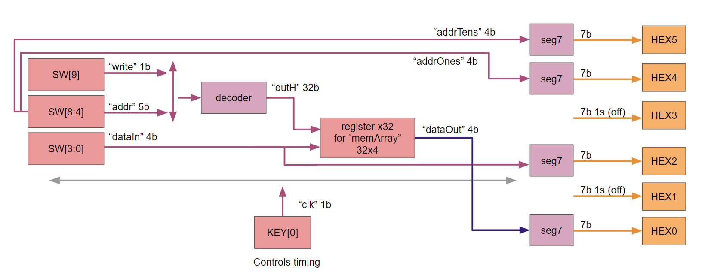
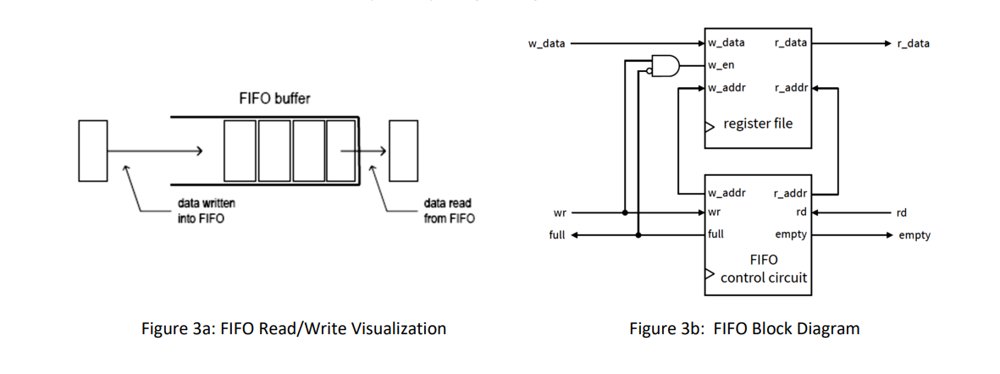
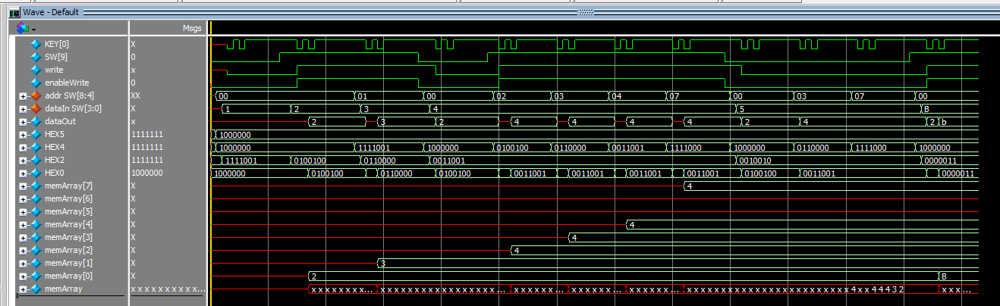
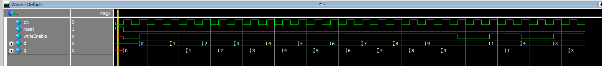
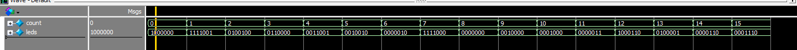
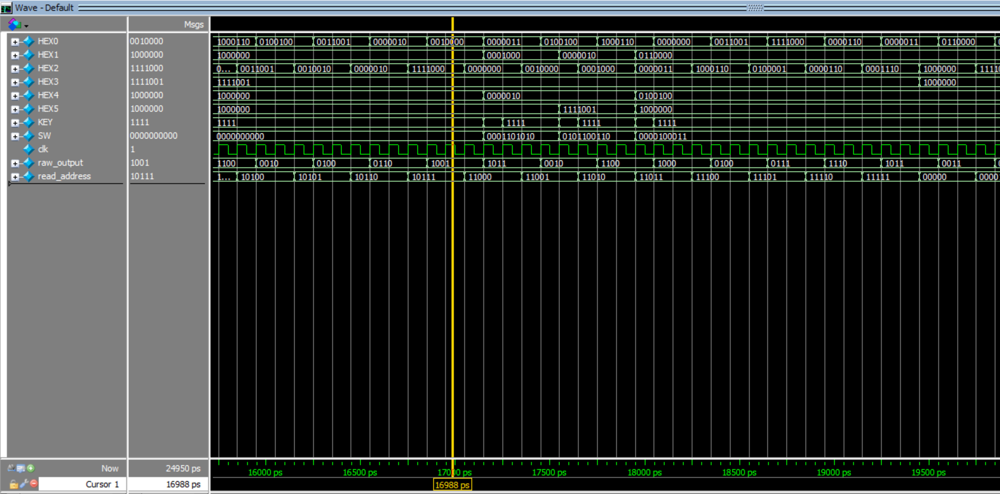
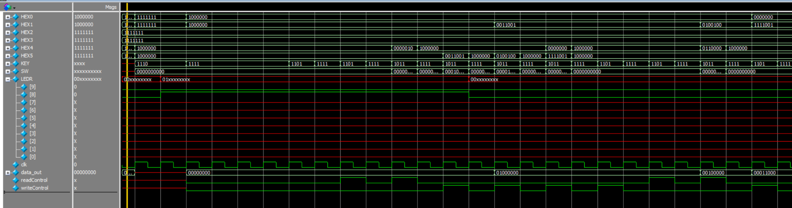
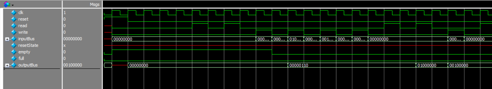
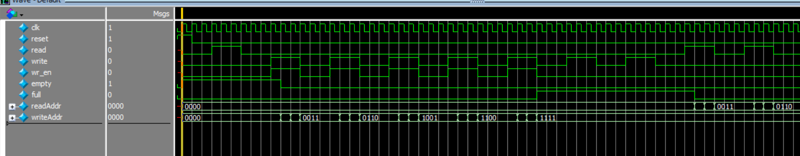
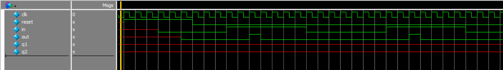

# Lab 2 Report: Memory Units 

## Procedure: 
This lab was made up of three subtasks/modules, which are each centered around different implementations of memory in SystemVerilog for the DE1_SoC FPGA board.

### Task 1:
This task was to implement a 32x4 memory unit, controlled by the switches and pushbutton on the DE-1 SoC board and output to the HEX display. We first began by programming the memory unit using an array with 32 registers to store 4b of data at each address, using SystemVerilog on Quartus. A decoder was used to specify which address would be selected to be written to or read from, and HEX display control was done through setting responses to input and output data.
 

> Figure 1. Block diagram of Task 1, implementation of 32x4 RAM

The overall design of the circuit is illustrated in Figure 1, with the inputs and outputs of each module controlling the DE-1 SoC inputs and outputs. After completely implementing the design in Quartus, results were then verified in ModelSim, before finally being synthesized onto a virtual DE-1 SoC board.

### Task 2:
This task was to again implement a 32x4 RAM but this time by using the built in modules that Quartas has.  Following the steps given on the lab doc, we can choose specifications for our RAM, such as what kind (2 port in our case), size, and different functionalities.  
One of these additional functionalities we use in this task is the option to have your RAM start filled with preset data.  To do this, we used a .mif file, which was specified in the lab doc as well.  

The final implementation of this task is similar to task 1, but not quite the same.  To demonstrate the .mif file, the DE1_SoC will continually show all words stored in the RAM, switching addresses about once per second.  To do this, we must keep in mind the clock is about 50Mhz.  

### Task 3: 
This task was to implement a FIFO buffer.  A FIFO buffer works similarly to a queue in that it takes in a word and can spit out a word, but only can do so in the order they came in.  

To achieve this task, we combine a similar RAM to the one we made in task 2 with a FIFO control unit which keeps track of the read and write addresses and the write enable for the RAM.  Similarly to a queue, the FIFO can be either empty or full, so we also incorporated the LEDRs to indicate each of these states.

> Figure 2. FIFO buffer diagram 

As shown above, the FIFO unit is really just a RAM and the FIFO control unit connected by some combinational logic and wires.  This diagram also shows that there is only write, read, and write data that the overall user has to worry about.  This is a much simpler interface to work with when storing words.  

## Results:

### Task 1:

> Figure 3. Waveforms for DE1_SoC module

The top-level module is the DE1_SoC, which stores input data into specified addresses in a 32x4 memory using registers. KEY[0] acts as the clock, and therefore on each clock edge, if enableWrite is HIGH the dataIn is read and stored into memory at addr. enableWrite is controlled by SW[9] and write, ensuring that the signal is matched to the clockedge. dataOut is read directly from the memory, and will read the corresponding dataIn that was input into memory. When not writing, an address can be specified to read past values. Additionally, addresses can have their data overwritten by specifying the same address to write to and inputting a new dataIn.

HEX5 and HEX4 both display addr, HEX2 displays dataIn, and HEX0 displays dataOut, all in hexadecimal format. 

> Figure 4. Waveforms for decoder module

decoder is a submodule in DE1_SoC that selects one of the output bits to be HIGH if enableWrite is also HIGH, otherwise all output bits are low. The number of output bits is parameterized, but for this instantiation, there are 32 output bits. In the simulation, the first five bits were selected in order while enableWrite was HIGH, and therefore were set to HIGH. While enableWrite was LOW, all bits were set to LOW.

> Figure 5. Waveforms for register module

register is a submodule in DE1_SoC that stores input data d and outputs that data as q, as long as writeEnable is HIGH. Otherwise, d is not stored and q holds its previous value. Upon reset, q is set to 0. Inputs and outputs are also controlled by the clock and are controlled by values on the clockedge.

> Figure 6. Waveforms for seg7 module

seg7 is a submodule in DE1_SoC that displays numbers on a single HEX display for the DE-1 SoC board by controlling which of the seven LED segments, the 7b bus for leds, are on or off. The value to display is dependent on count, which can range from 0 to 15 as the display is in base 16 (hexadecimal).

### Task 2:

> Figure 7. Waveforms for DE1_SoC for task 2

Shown above is part of the waveform for the top level module in task 2.  The first thing to note is that the read address on the bottom is constantly increasing by one every few clock cycles.  This is set in the code for simulation, but in real execution, the read address increases once per second which is many clock cycles and not suitable for simulation.  Along with these increments of read_address, we can see the raw output is the numbers we put into the .mif file.

A few clock cycles after the yellow cursor, you can see that we rewrote some of the words and toggled on the wr_en using one of the SWs.  To check that this worked, we looked further down the simulation at the addresses we changed.

After this test, we had to change the code so that the read_address would update appropriately with a clock that is 50Mhz, and then it ran successfully on labsland.
This task also uses seg7 file, whose waveform is shown in task 1 results.
Task 3:

> Figure 8. Waveforms for DE1_SoC for task 3

Shown above is the waveform we used for the top level in task 3.  This waveform is not as long and extensive because the top level module in this task doesn’t do much more than connecting data wires to the peripherals of the DE1_SoC board and instantiating the FIFO.  Thus, the key thing to see here is that HEX and LEDR are updating appropriately.  Finer details of the functionality are easier tested at the FIFO waveform because we don’t need to manage inputs from SWs and outputs to HEXs but rather raw data in plain bits.

> Figure 9. Waveforms for FIFO

Above are the waveforms for the FIFO module.  These waveforms demonstrate a few important points which help us in knowing our module is functioning.  Primarily, we start with the empty signal, and try to read, however nothing can occur because we have nothing to read.  The address does not update.  Next we write some words and the empty signal turns off.  Similar tests are done in the reverse order to test full signal and write.  This gives a comprehensible answer that the overall combination of FIFO control and RAM are working correctly together.

> Figure 10. Waveforms for FIFO_control

Shown above is the waveform for the FIFO_Control module.  This module controls what address and when the RAM will be written to, and also what address the RAM is reading from.  Additionally, in the waveform we can see the empty and full signals both being displayed as true when the appropriate number of words or lack thereof is in the RAM.  Also of note is the wr_en is true with the write signals which means the logic that will be connecting the RAM is functioning properly.

> Figure 11. Waveforms for user_input

The simple waveform above is for the user_input module.  This module simply takes in user input and returns true for one clock cycle, and will not accept any more input until the user signal returns to zero for at least one clock cycle.  Shown above, this is functioning correctly as the user input is true for about 6-8 clock cycles, and the output is only true for one cycle.  This is essential in the functioning of this overall task.

This task also uses seg7 file, whose waveform is shown in task 1 results.

### Final Product:
The goal of this lab was to implement a memory unit through different methods, firstly by designing our own 32x4 memory unit using registers, then instantiating the Quartus-generated memory unit to control the DE-1 SoC HEX display outputs, and finally modeling a FIFO memory unit.

## Appendix:
### Code Files:
1.	Task 1
- DE1_SoC.sv
- decoder
- register
- Seg7

2.	Task 2
- DE1_SoC.sv
- ram32x4
- ram32x4.mif

3.	Task 3
- DE1_SoC.sv
- User_input
- ram16x8
- FIFO
- FIFO_Control