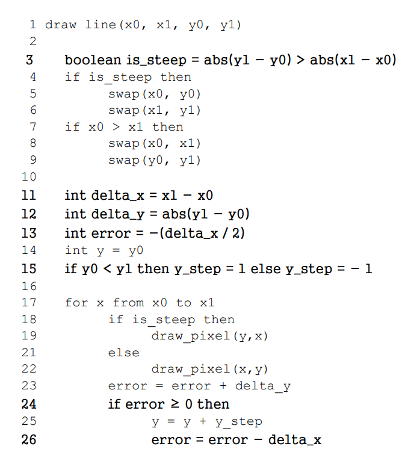
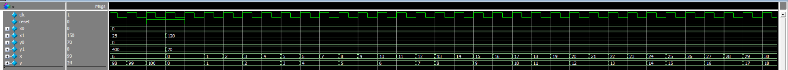
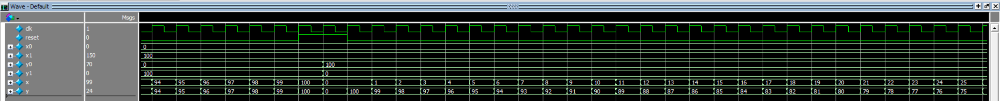
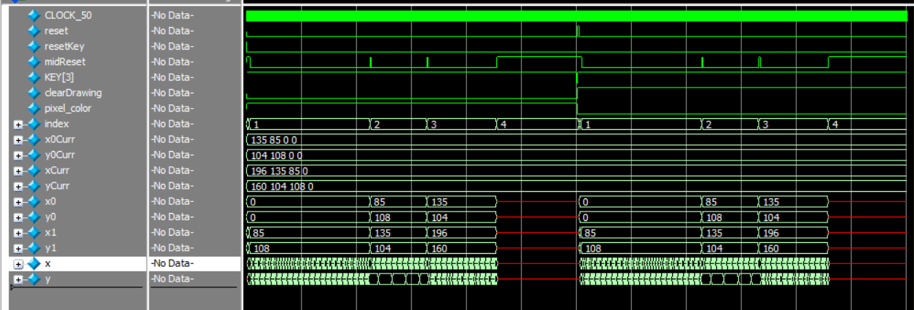
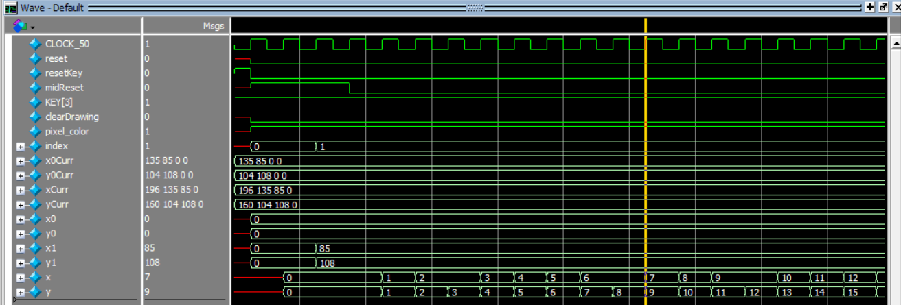
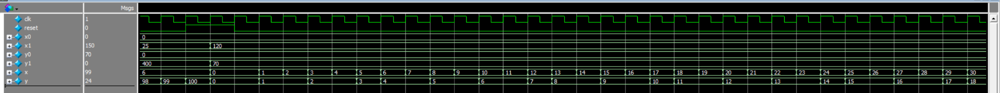

# Lab 3 Report: VGA 
Partnered Work

## Procedure: 
In this lab, we used the VGA extension of the DE1_SoC board to draw lines.  A simple task when you say it, however we want to draw lines of any slope depending on the two points (pixel coordinates) that the line connects. This requires us to use Bresenham’s algorithm to calculate what coordinates should be used to get the best looking line.

### Task 1:
Task 1 focuses on Bresenham’s algorithm, and asks us to create a module in SystemVerilog which takes in four values (two coordinate pairs) and outputs pixel points which should be filled to create a line between the two given points.  

Having taken higher level of abstraction coding classes using languages such as Java and Python, reading the pseudocode below makes this task seem easy.

> Figure 0. Bresenham's Algorithm Psuedocode

This however is not true for a hardware description language.  Variables cannot be thought of as exactly the same as logic and wires in SystemVerilog, therefore implementing this in our case is not as simple.  

I decided to approach this problem in two parts, finding out the actual coordinate points I would use, and iterating over them, either x or y and calculating the other value and returning it.  This requires a combination of combinational and sequential code blocks working cohesively.  Following the pseudocode, we will find delta values and a boolean ‘is_steep’ value.  Because this is not a language like Java, we have to create a new piece of logic for each of the four x,y coordinates that we can actually manipulate, as the input logic cannot be changed within the module.  Finally, we follow the pseudocode and create a sequential logic block that iterates on either x or y depending on the is_steep value.  Each iteration is similar to the for loop, and each iteration takes one clock cycle.  Each iteration, the non iterated coordinate either left the same, or increased by one or decreased by one.  This is determined by the error value which is shown in the pseudocode.

### Task 2:
Task 2 has two parts: making an animation of a line moving without user control, and clearing the canvas after drawing the lines. For the first part, I decided it would be best to have an array of beginning and end coordinates to construct multiple lines in order automatically. This involved making an index to go through the array to set the new coordinate values, and updating that index once the full line had been drawn. Using the line_drawer module made in the first task, for each array index, the beginning and end coordinates would be updated so the line_drawer module would draw a line between those two points. Then, with the next index, the beginning and end coordinates for the line_drawer module were reset, so they are ready to draw a new line. This repeats until all lines in the array have been drawn.

For the second part of task 2, the line_drawer module was used again, this time with the pixel color reversed from before, to match the black background of the VGA display. Then, the same lines that were drawn before are repeated. In this way, the previous lines are erased and the entire canvas is now black. Erasing the lines is controlled by a keypress and will clear any lines that have been drawn.

## Results:

### Task 1:

> Figure 1. line_drawer waveform (0,70)(120,0)

As shown in figure 1, the x and y output signals change each clock cycle and follow the pseudocode.  This line shown in figure 1 is a non-steep line which has slope less than 1, therefore we can see that y pixels change slower than the x pixels which are iterated every clock cycle.

> Figure 2. line_drawer waveform (0,100)(100,0)

Shown in figure 2 is another example line from the line_drawer waveforms.  This line is a negative sloping line with a slope of -1.  As shown, the output x and y values change each clock cycle and are inverted of each other this time.  We tested different lines of the following characteristics to be sure of the functionality of our module: horizontal line, vertical line, line of slope 1, line of slope -1, line of slope less than 1, line of slope greater than 1, and a line of negative slope greater than -1.  By testing each case specifically in the waveform generator, we can be sure that the line_drawer can take any set of coordinate pairs in any order.

### Task 2: 

> Figure 3. Overall DE1_SoC waveform drawing 

Figure 3 illustrates the signals for the DE1_SoC waveform in task 2, which is an animated line. The initial x and y values are in the array x0Curr  and y0Curr, which each time index increases, updates x0 and y0 to the corresponding value in the array. The same applies for x1 and y1, with coordinates stored in xCurr, yCurr. The output is x, y, which are the pixels to update on the VGA display. The details of signals x and y are shown below in Figure 4. 

Otherwise, once KEY[3] is pressed (which KEY[3] is active LOW), the signal to clear the drawing is triggered (clearDrawing) and the pixel color is reversed to erase the lines. The signal for reset is triggered, which returns index to 0 to repeat drawing the lines. resetKey is for a full system reset to refresh the VGA display, though keeping the lines. midReset is for when the target coordinate of each line has been reached, and the initial and target coordinate must be shifted to the next one in the array. If there is none, do not output any line.

> Figure 4. Zoomed-in DE1_SoC waveform drawing 

Above is the DE1_SoC waveform zoomed in to observe the changes in x and y. Currently, the index is at 1, therefore, x and y will update, changing at most one pixel each clock cycle, starting at (0, 0) to (85, 108).

> Figure 5. line_drawer waveform (0,70)(120,0)

The same module created in Task 1 was used in Task 2, therefore, the modelsim simulation in Figure 5 matches the results of Figure 1.

### Final Product:
After completing this lab, we have a better understanding of the VGA capabilities of the DE1_SoC board.  We also practiced implementing an algorithm in hardware, and ended up with an animation of a line on the VGA display.

## Appendix:
### Code Files:
1.	Task 1
- DE1_SoC.sv
- line_drawer.sv
- VGA_framebugger.sv

2.	Task 2
- DE1_SoC.sv
- line_drawer.sv
- VGA_framebugger.sv
- clock_divider.sv
