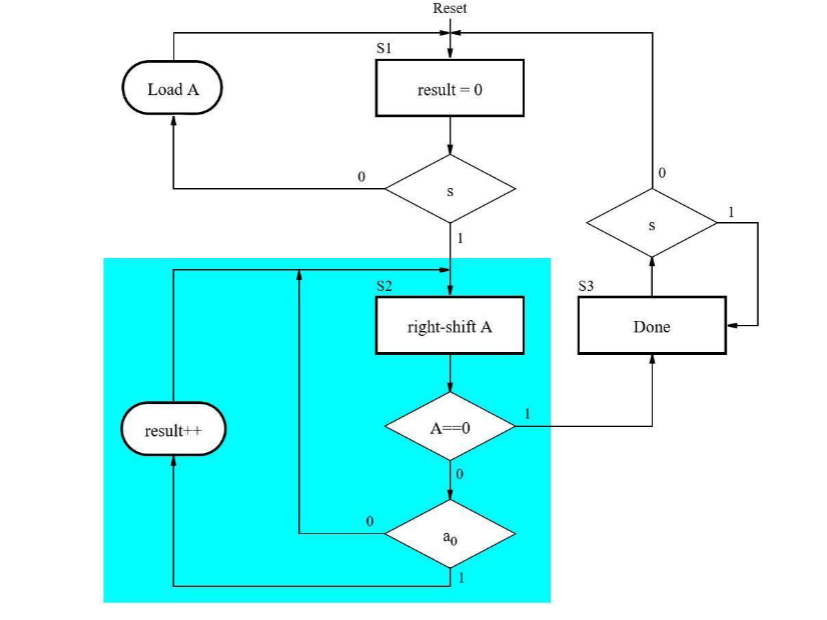
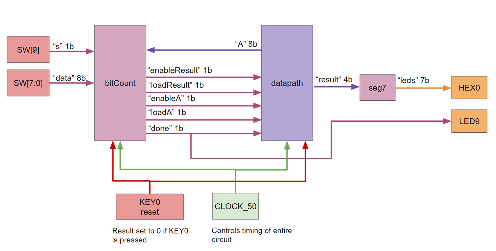
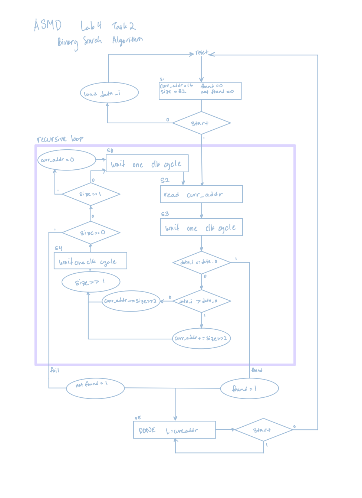
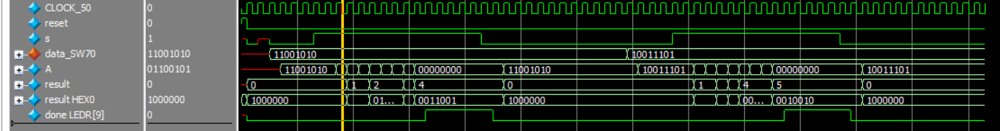
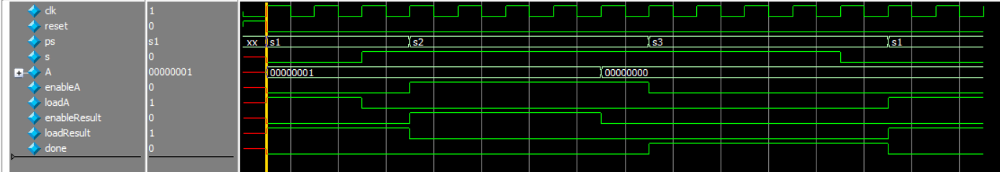
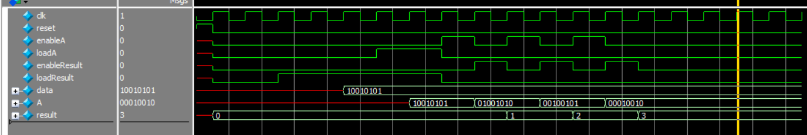
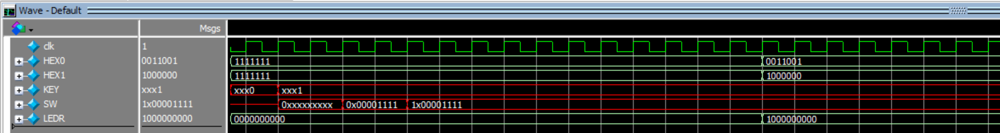
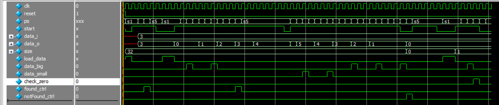
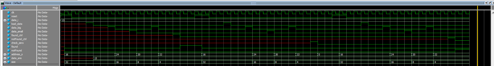

# Lab 4 Report: High-Level Algorithms
Partnered Work

## Procedure: 
This lab was made up of two subtasks/modules. The first task is to build a bit counter, and the second task is to implement a binary search algorithm, both using SystemVerilog for the DE1_SoC FPGA board.

### Task 1:
This task was to write the SystemVerilog equivalent to the given ASMD chart (Figure 1).
 

> Figure 1. ASMD Chart for Task 1 - Bit Counter

The circuit was implemented with two modules, controller and datapath, which interact in sending signals to each other in controlling the DE-1 SoC inputs and outputs. The signals are illustrated in Figure 2. bitCount is the main controller for the circuit, by receiving data from the datapath and determining the response. The datapath module receives these control signals and performs any bit operations such as shifting. The result of counting the bits is sent to seg7, which displays the value of result to HEX0 of the DE-1 SoC. LED9 is also linked to the “done” control signal to show when the algorithm has finished counting the number of bits with a value of 1 in the given data.
 

> Figure 2. Block Diagram for Task 1 - Bit Counter

After completely implementing the design in Quartus, results were then verified in ModelSim, before finally being synthesized onto a virtual DE1 SoC board.

### Task 2:
This task was to implement a binary search algorithm using SystemVerilog. This was done by first making an ASMD chart (Figure 3) to visualize signals and states, before programming with SystemVerilog in Quartus.  Creating and planning this ASMD chart was probably the most difficult part of this task.  Planning out a more complicated recursive algorithm such as binary search into an FSM format required figuring out what patterns we needed to use, as well as ensuring that the implied timing would work along with all registers and control paths.

Part of this task was to implement a RAM file from previous labs to store the array we would search through.  This poses an issue which causes us to require extra states which simply allow the FSM to wait one clock cycle.  We need this because there is a one clock cycle delay between the time we send an address to the RAM and the time the correct data is output from the RAM.  As shown in the ASMD chart, we ended up needing three of these extra clock cycles, however in a real time system, this is pretty small, and thus our algorithm is still more efficient than searching every value in the array one at a time.

Once the ASMD chart has been constructed, it is just like moving the design straight into SystemVerilog.  Making the chart forces us to solve most coding issues we will come up against beforehand, speeding up the writing and debugging process.

> Figure 3. ASMD Chart for Task 2 - Binary Search Algorithm

## Results:

### Task 1:

> Figure 4. Waveforms for DE1_SoC module

The top-level module is the DE1_SoC, which overall tracks the control signals from bitCount and the data signal to count and update the number of bits in the input data that equal 1.

From the start, the result is set to 0 after reset. Then, input data from SW7-0 are loaded into A. When s, or start, is HIGH, each bit of A is checked by shifting to the right repeatedly. For every shifted bit that equals 1 (as highlighted by the yellow cursor, A = 01100101, so LSB is 1), the result is updated by 1. If not, then result is not updated. When A equals 0, the final result is displayed on HEX0, and done goes HIGH. This remains until s, or start, goes LOW, and then the system is ready for another input of data from the switches, and the algorithm can start again. seen here with data set to 10011101, which was found to have 5 bits of 1.

> Figure 5. Waveforms for bitCount module

bitCount is a submodule in DE1_SoC that controls what operation the datapath module should execute and when, depending on the input data from the switches and the manipulated data received from the datapath module. Reset initializes the state to s1, which causes loadResult to go HIGH, which would tell the datapath to set result to 0, and loadA is HIGH, which sets A to the input from the switches in the datapath module. When s goes HIGH, the state transitions to s2, and loadA goes LOW to stop setting A to the input from the switches, and enableA is set to HIGH to start the bit manipulation on A. If the LSB for A is 1, then enableResult is HIGH. If the signal for A received by the datapath is equal to 0, the state transitions to s3, which sets done to HIGH and stays there as long as s is HIGH. Otherwise, go back to s1.

> Figure 6. Waveforms for datapath module

datapath is a submodule in DE1_SoC that, receiving input control signals enableA, loadA, enableResult, loadResult, and data, will output the result of however many bits have been counted to be 1, as well as the current version of the data after bit manipulations, A. Inputs and outputs are synced to the clock edge, and upon reset, will be set to LOW.

Here, when loadResult is high, the result is set to 0 for initialization. Data is then input, which represents the switch inputs, and when loadA is HIGH, this data is saved to A. enableA shifts A one bit to the right to perform operations on the next bit. enableResult goes HIGH to update result by 1. The actual timing and responses of whether enableResult should be HIGH and result should increase by 1 is controlled by the interaction between bitCount and datapath, though datapath will perform the operations once the signal is received.

> Figure 7. Waveforms for seg7 module

seg7 is a submodule in DE1_SoC that displays numbers on a single HEX display for the DE-1 SoC board by controlling which of the seven LED segments, the 7b bus for leds, are on or off. The value to display is dependent on count, which can range from 0 to 15 as the display is in base 16 (hexadecimal).

### Task 2: 

> Figure 8. Waveforms for DE1_SoC for task 2

Shown above is part of the waveform from the DE1_SoC testbench for task 2.  This part of the simulation is showing a reset of the system, and input of 4 and a start signal in the system, and finally the completed algorithm output onto HEX 1 and 0, of an address which is 04.  We also tested other cases for our final design such as a larger address (input a value of 220 with an expected address of 30 (1E)), a search failure (inputting a value of 221 expecting a notFound), and what happens when we use the edge case of address 0 (input value of 0 expecting address 00).

All of our cases worked and we were able to successfully run our design on LabsLand.  Implementing the DE1_SoC file was rather straightforward once we had our submodules complete.  All we needed to do was connect internal wiring between each submodule, and connect the necessary I/Os of the board.  

> Figure 9. Waveforms for binary_search_control

Shown above are the waveforms for the binary_search_control module. Whenever in state s1, load_data is high, so the input data, data_i is saved. It can be updated until start goes HIGH, which will prevent data_i from being loaded again.

The control module is first checked for when that output data, data_o is immediately equal to data_i, meaning the data was found immediately and therefore found_ctrl should go HIGH. The second case checked is for when a later iteration of data_o is found to match data_i, where data_i is larger than data_o, so data_big goes HIGH for each iteration until the data is found, which is indicated by found_ctrl. The third case is similar, but where data_i is smaller than data_o, so data_small goes HIGH for each iteration until the data is found, which is indicated by found_ctrl. Finally, if the entire memory has been searched, meaning size is 0, but the data did not match, then notFound_ctrl should go HIGH. Otherwise, if at the last iteration where at address 0, then check_zero should go HIGH.

Overall, the start signal initiates the search, and when the algorithm is complete and the system is in state s5, it will stay finished until start goes LOW, which will return the system to the start at state s1 so the search can begin again with new data.

> Figure 10. Waveforms for binary_search_datapath

Shown above are the waveforms from our simulation of the datapath module for the binary search algorithm.  In this simulation, we input each different type of control signal, in an order which would be expected from the system running in real time and real inputs.  We looked at the output such as found, notFound, address, and size to ensure the values we are getting are expected.  As shown, size and address are changing correctly in a fashion to sort through an array using binary search.  

> Figure 11. Waveforms for seg7 module

seg7 is a submodule in DE1_SoC that displays numbers on a single HEX display for the DE-1 SoC board by controlling which of the seven LED segments, the 7b bus for leds, are on or off. The value to display is dependent on count, which can range from 0 to 15 as the display is in base 16 (hexadecimal).

 ### Final Product:
 
The goal of this lab was to practice implementing hardware accelerators of high level algorithms.  I felt like we learned a lot using the ASMD charts, and especially having to make our own forced thinking about the differences between software only algorithms and hardware. 

## Appendix:
### Code Files:
1.	Task 1
- DE1_SoC.sv
- bitCount.sv
- datapath.sv
- seg7.sv

2.	Task 2
- DE1_SoC.sv
- binary_search_control.sv
- Binary_search_datapath.sv
- seg7.sv
- ram32x8.sv
- my_array.mif
