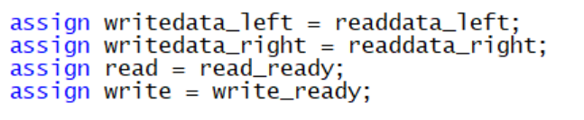
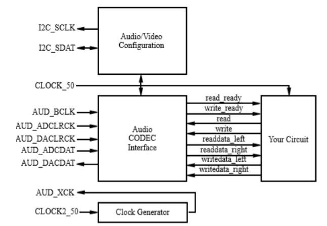
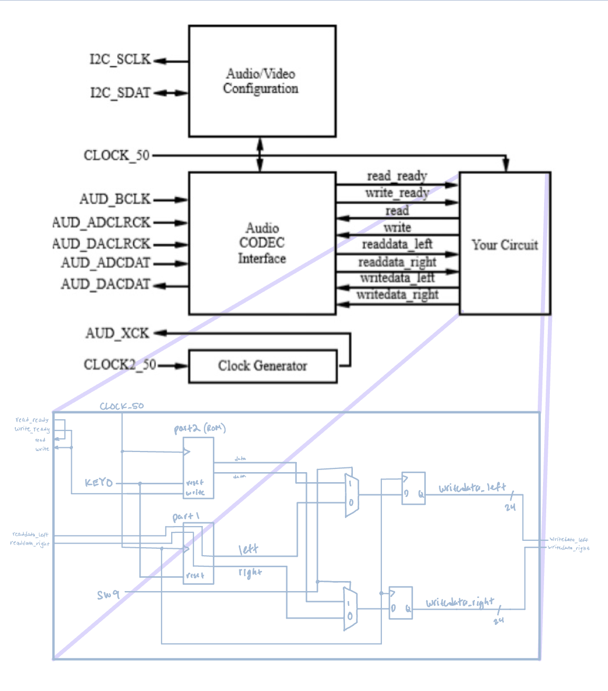
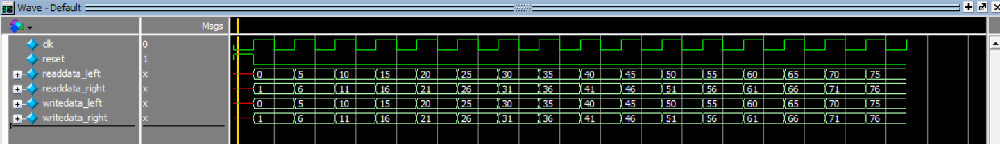
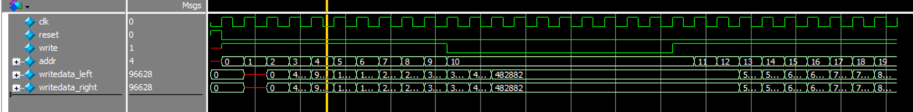

# Lab 5 Report: Audio
Partnered Work

## Procedure: 
In this lab, we learn about signal processing and the audio coder/decoder CODEC that the DE1_SoC board offers.  This requires many modules to drive this function of the DE1_SoC, but many of them are provided to us for this lab.  We need to connect data paths properly to read and play audio from an audio file and also a saved note on a constructed ROM.

### Task 1:
Task 1 doesn’t require much work on our part.  We are provided with the CODEC implementation already set up, we just need to connect the audio input to the audio output, only when the CODEC is ready.  The following is all the code needed to implement this.

> Figure 0. Write/Read Driver Modifications

As shown, we connect the appropriate connections to wires that were given to us in the starter code.

> Figure 1. CODEC configuration block diagram

### Task 2:
Task 2 is a bit more involved than Task 1.  Not only do we want to keep the functionality of Task 1 where we can take in audio, and play it back, but we also want to be able to play audio from the contents of a ROM which is filled with a single note.  

We get the contents for the ROM in the form of a .mif file which is constructed by a python script provided to us in the lab.  This script can take in frequency, amplitude and length of a note and create a .mif file to correspond to it.  

We created our ROM file with the IP Catalog provided in Quartas, and set it up to be filled with data from our .mif file.  Once we have our ROM constructed, we cycle through each address in the ROM while we are writing to CODEC.  By doing this, we are sending an ‘audio’ signal to the CODEC which is played and corresponds to the note we had the python script write.  Shown below in figure 2 is the block diagram of the datapath for this process.

> Figure 2. Datapath around ROM

As shown, we need a few datapath structures inside the incrementer in order to properly index the address of our ROM.  The output from the ROM will behave like audio data.  Now that we have this source of audio data, we need to be able to switch between this and what we did in Task 1 with taking in audio files.  Shown below is the entire block diagram for our design in Task 2 which incorporates two new modules which are selected based on the input to SW9.

> Figure 3. Task 2 Overall Block Diagram

We can see the module part2 which contains our ROM instance and datapath, and how it connects to the rest of the CODEC.  We also have a module part1 which is simply the assignments we showed in the Task 1 procedure.  These two modules’ outputs are then selected by 2x1 muxes which are controlled by SW9 on the DE1_SoC.  These data outputs are then sent to the CODEC.

## Results:

### Task 1:
To run Task 1 in Labsland, we used a file called piano_noisy.mp3.  This file contains some static and some music of a band centered around a piano melody.  In labsland, we used the DE1_SoC in Verilog with audio features, and played the mp3 to the DE1_SoC while recording the output of the board simultaneously.  The resulting output was that the board could play the mp3 file from its memory.

### Task 2:
Running Task 2 in Labsland is similar to Task 1, but now we have extended functionality.  We really want to demonstrate the ability to switch between audio from the piano_noisy.mp3 file and the audio from the note in the ROM.  To do this, we begin recording with SW9 set to 0, and then while the audio file is still playing, switch SW9 to 1 for a few seconds and then back to 0.  What results is an audio file which begins playing the piano_noisy audio, but then suddenly switches to single note, and then resumes piano_noisy.

Results of the simulation submodules of the task2 module are illustrated below in Figure 4 and Figure 5.

> Figure 4. Task 2 part1 module
 
As expected of the part1 submodule for task2, writedata_left matches the value of readdata_left, while writedata_right matches the value of readdata_right. Both writedata signals also change immediately when the readdata signals change.

> Figure 5. Task 2 part2 module
 
As expected of the part2 submodule for task2, writedata_left and writedata_right match the values for the generated note stored in memory. Signals only change if write is enabled, which is controlled by the upper-level module, task2. Data written is updated after two clock cycles, as the write signal is sent to the memory unit in one clock cycle, and then the memory unit is read in the next clock cycle. write signal can be reenabled to continue reading from memory if it was previously disabled.

### Final Product:
After completing this lab we have gained a better understanding of the functionality of the CODEC feature of the DE1_SoC board, and practiced working in Verilog on datapath components and memory.  Our resulting product is an audio device which can take in audio from a file, or its own internal ROM which can be preset with a .mif file.  
 
## Appendix:
### Code Files: 
1.	Task 1
- part1_task1.v
- Altera_UP_Audio_Bit_counter.v
- Altera_UP_Audio_In_Deserializer.v
- Altera_UP_Audio_Out_Serializer.v
- Altera_UP_Clock_Edge.v
- Altera_UP_I2C.v
- Altera_UP_I2C_AV_Auto_Initialize.v
- Altera_UP_I2C_DC_Auto_Initialize.v
- Altera_UP_I2C_LCM_Auto_Initialize.v
- Altera_UP_Slow_Clock_Generator.v
- Altera_UP_SYNC_FIFO.v
- audio_and_video_config.v
- audio_codec.v
- clock_generator.v

2.	Task 2
- task2.v
- part1.v
- part2.v
- low.mif
- rom_1port.v
- Altera_UP_Audio_Bit_counter.v
- Altera_UP_Audio_In_Deserializer.v
- Altera_UP_Audio_Out_Serializer.v
- Altera_UP_Clock_Edge.v
- Altera_UP_I2C.v
- Altera_UP_I2C_AV_Auto_Initialize.v
- Altera_UP_I2C_DC_Auto_Initialize.v
- Altera_UP_I2C_LCM_Auto_Initialize.v
- Altera_UP_Slow_Clock_Generator.v
- Altera_UP_SYNC_FIFO.v
- audio_and_video_config.v
- audio_codec.v
- clock_generator.v

