# Lab 6 Report: Parking Lot Occupancy with External Simulator
Partnered Work

## Procedure: 
In this lab, we put into practice many different tools we learned throughout the quarter.  We are combining these in order to use a new 3D parking simulator on LabsLand.  By using this simulator which we are not familiar with, we can experience what a real world engineer would feel like working with SystemVerilog along with integration of new sensors and systems.

### Task 1:
The main focus of task 1 was to get used to using the updated breadboard functionality in LabsLand.  To practice this, we use the parking lot sensor we created in lab 1.  The only changes that we have to implement are in the DE1_SoC top level module, where the name of the inout logic for the GPIO pins are changed.

As shown below, all instances of GPIO_0 have been changed to V_GPIO.

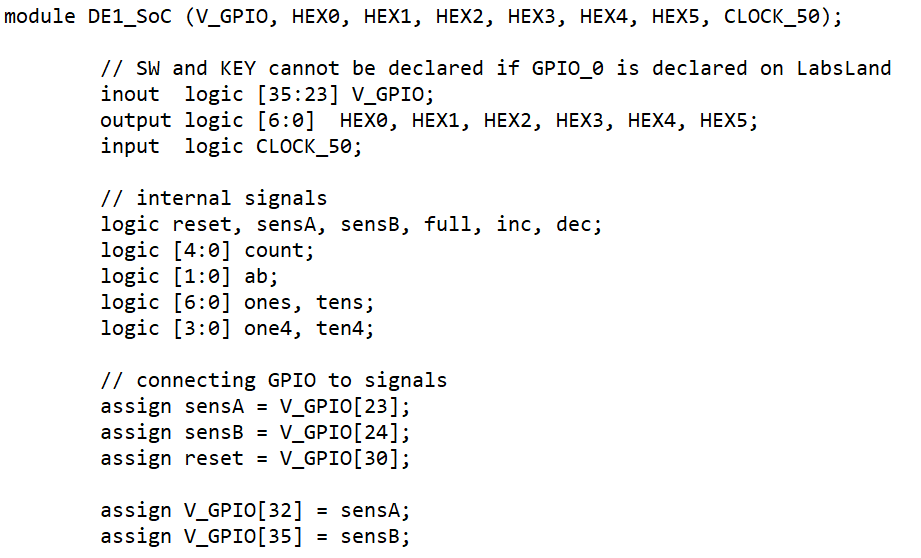
> Figure 1. DE1_SoC code
 
### Task 2:
For task 2, the focus was to connect to a simulation of a parking lot and monitor the entering and exiting of cars, while also having a tracker for rush hour start or end, and reading back the total number of cars that entered the parking lot for each hour.

To implement rush hour start and end control, a finite state machine was used to represent the current state of the parking lot and whether it was in rush hour or not, and send control signals to a datapath module to record the current hour into registers.

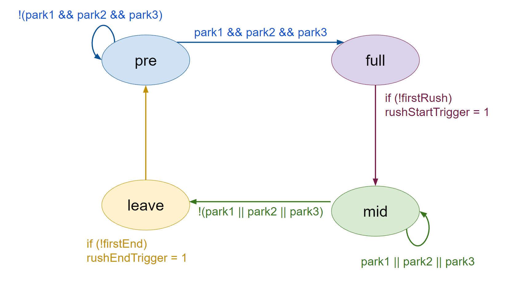
> Figure 2. FSM for control module to determine if rush hour should be triggered or not
 
In addition to our finite state machine, we have a 8x4 RAM module to record the total number of cars that entered the parking lot for each hour. Each address represents the hour, and the data is the total number of cars, which is constantly recorded throughout the work day. At the end of the work day, these addresses are to be read from the memory and displayed on the HEXs on the DE-1 SoC board.

Finally, to ensure that keypresses only counted for one clock cycle, we have an additional finite state machine to limit the output for continuous HIGH inputs to one clock cycle.

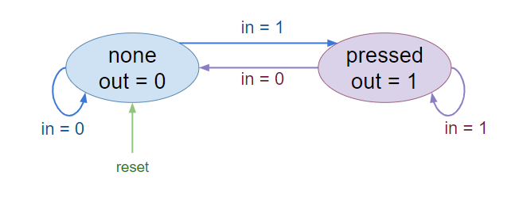
> Figure 3. FSM for inputs to be limited to one clock cycle outputs
 
## Results:
### Task 1:
After uploading to LabsLand, we have to work with the new breadboard configuration.  The figure below shows our setup to use the parking lot counter.  Note that the pins of our wires are connected to correspond to the code in Figure 1.  Also for reference, blue wires refer to inputs, and green wires refer to outputs.

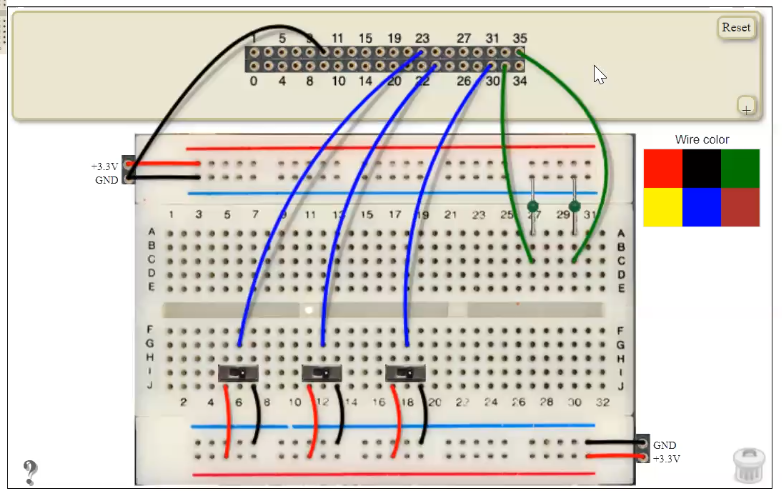
> Figure 4. Breadboard configuration
 
### Task 2:
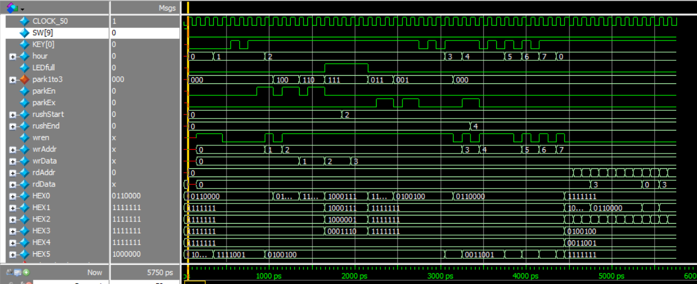
> Figure 5. DE1_SoC top-level module waveforms
 
The waveforms for top-level module DE1_SoC are shown above. As expected by the prompt, on each KEY[0] press, the hour advances by one, controlling the work day hours. This change in hour is illustrated on the HEX5 display on the DE-1 SoC board using submodules hexControl and seg7 below. The presence of cars in the parking spaces is monitored in park1to3, and the presence of cars at the gate is monitored by parkEn and parkEx for entrance and exit. Whenever there is a car at the entrance (with the number illustrated on HEX0) and there are still parking spaces left, a car occupies a parking space. The number of cars that have entered after each hour is also recorded to memory as wrAddr records the hour, wrData is the number of cars total, and wren enables the write to memory.

The first time the parking lot is full (3 cars) signifies the start of rush hour and rushStart records the current hour. When the parking lot empties, rushEnd records the hour it emptied. Anytime the parking lot is full, HEX 0 through 3 display “FULL.” After the end of the day, past hour 7, the HEX display changes to read a record of the day, which is illustrated below.

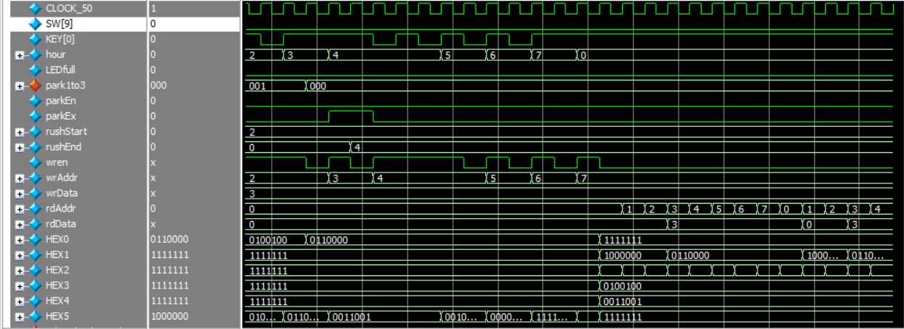
> Figure 6. DE1_SoC read cycling after hour 7
 
Above is the DE1_SoC module with the waveforms after hour 7 emphasized. When the hour has passed 7, the HEX1 displays the total number of cars that have passed the entrance gate at each hour, with the hour displayed on HEX2. These values are read from memory with rdAddr and rdData, and will continue to cycle until the system is reset. Additionally, rushStart is displayed on HEX3, and rushEnd is displayed on HEX4. All other HEXs are blank.

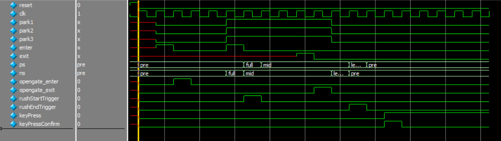
> Figure 7. control module waveforms
 
The sub-module control determines the main functionality of rush hour and cars entering or exiting. Anytime a car is detected at the entrance and there are still spots left, opengate_enter goes HIGH. If a car is detected at the exit, then opengate_exit goes HIGH.

Until the parking lot is full, the system is in state “pre.” When the parking lot is full, the system goes into state “full” and then to “mid” to signify the first time the parking lot is full and set rushStartTrigger to HIGH. When the parking lot empties afterwards, the system transitions to state “leave,” and rushEndTrigger is set to HIGH to signify that the end of rush hour has occurred.

Additionally, the control module monitors keypresses to ensure that even if a pushbutton is held down, the output is only one clock cycle.

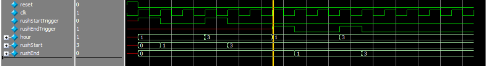
> Figure 8. datapath module waveforms

The sub-module datapath responds to control signals, recording the current hour to rushStart if rushStartTrigger is HIGH, and recording the current hour to rushEnd if rushEndTrigger is HIGH.

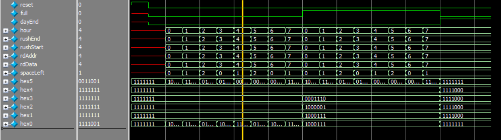
> Figure 9. hexControl module waveforms
 
Sub-module hexControl is the main controller for the HEX displays. It ensures that if data is not being currently displayed to a HEX, that the HEX is turned off. Also, data that is required to be displayed is shown at the right time.

HEX5 displays the current hour through assignment of its LED segments. HEX4 is off until the end of the day, then displaying the first time rush hour end was detected, or “-” if there was no end to rush hour end detected. HEX3 is also generally off until the end of the day, only turning on to display “F” for “FULL” if the parking lot is full. At the end of the day, it will then display the first time rush hour start was detected or “-” if there was no end to rush hour end detected. HEX2 turns on during the day to display “U” for “FULL,” but is otherwise off until the end of the day. At the end of the day, displays the hour, or rdAddr, for each slot in memory. HEX1 turns on during the day to display “L” for “FULL,” but is otherwise off until the end of the day. At the end of the day, displays the number of cars, or rdData, for each slot in memory. HEX0 turns on during the day to display “L” for “FULL,” but otherwise displays how many spaces in the parking lot are left before the end of the day. At the end of the day, HEX0 is turned off.

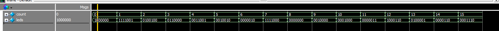
> Figure 10. seg7 module waveforms 
seg7 is a submodule in hexControl that displays numbers on a single HEX display for the DE-1 SoC board by controlling which of the seven LED segments, the 7b bus for leds, are on or off. The value to display is dependent on count, which can range from 0 to 15 as the display is in base 16 (hexadecimal).

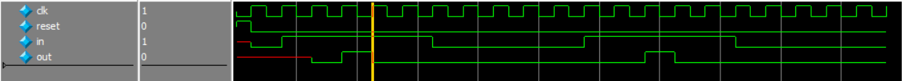
> Figure 11. user_input module
 
user_input is a submodule in DE1_SoC that ensures an input is only HIGH for one clock cycle output, regardless of how long the input is continually HIGH. Additionally, it reduces the chance for metastability by sending the input through a two clock cycle delay.

### Final Product:
After completing this lab we have a completed 3D parking lot simulator functioning on a DE1_SoC board in LabsLand.  We have combined the knowledge of SystemVerilog hardware implementation, and different logic structures such as FSMs, and control with datapath modules which we have learned throughout the quarter.
 
## Appendix:
### Code Files: 
1.	Task 1
- DE1_SoC.v
- lotCounter.v
- lotSensor.v
- seg7.v

2.	Task 2
- DE1_SoC.v
- datapath.v
- control.v
- clock_divider.v
- hexControl.sv
- seg7.sv
- ram8x4.v
- user_input.sv

